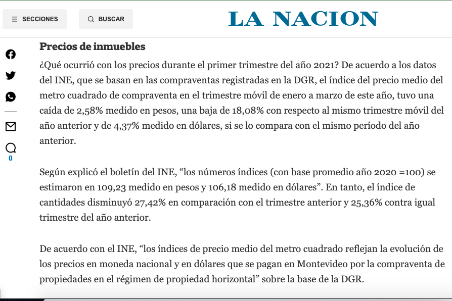
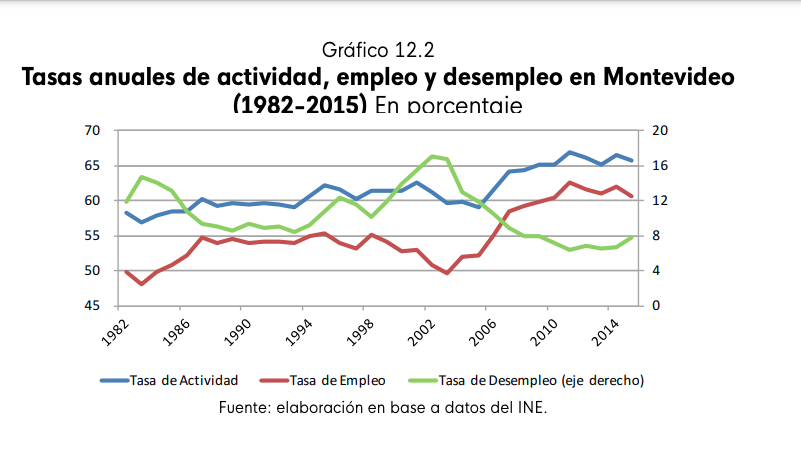

```{r setup, include = FALSE, warning = FALSE}
  knitr::opts_chunk$set(
    echo = FALSE, 
    fig.height=4, 
    fig.width=6, 
    warning=FALSE, 
    message = FALSE,
    dev = "png")

library(tidyverse)
library(kableExtra)

options(kableExtra.html.bsTable = TRUE)

theme_set(theme_minimal() + 
            theme(plot.title = element_text(hjust = 0.5)))

celeste <- "#5e81ac"

```


```{r}
xaringanExtra::embed_xaringan(
  url = "/slides/mercado-de-trabajo/",
  ratio = "16:9"
)
```


```{r include=FALSE}
knitr::opts_chunk$set(echo=FALSE, warning = FALSE,
                       message=FALSE)

library(tidyverse)
library(kableExtra)
theme_set(
  theme_minimal(base_family = 'Montserrat',
                base_size=16) + 
    theme(plot.title=element_text(hjust=.5)))


marcar_punto <- function(x, y, linetype="dashed") {
  list(
    geom_segment(x=x, y=0, xend=x, yend=y, color="gray50",
                 linetype="dotted", inherit.aes = FALSE),
    geom_segment(x=0, y=y, xend=x, yend=y,  color="gray50",
                 linetype="dotted", inherit.aes = FALSE),
    geom_point(x=x, y=y, inherit.aes = FALSE)
  )
}


```

# Ejercicio 1

<!-- 1. Descargar y graficar las tasas de actividad, desempleo y empleo desde 1975 hasta el último dato disponible. Explicar qué significa cada indicador.  -->

Suponga una empresa que produce tomates con la siguiente función de producción.

```{r}

tibble(
  L=1:5,
  PMgL=c(8, 10, 7, 5, 4)) %>% 
  knitr::kable(col.names = c("L", "Producto Marginal")) %>% 
  kable_styling(full_width = F)
```

-
    a) Calcular el valor del producto marginal si el precio de venta de los tomates \$2. Si el salario es \$10 y ¿cuántos trabajadores contratan?

    b) Calcular el valor del producto marginal si el precio de venta de los tomates baja a \$1. ¿cuántos trabajadores se contratan ahora?

    c) Graficar la curva de demanda de trabajo antes y después de la caída del precio de los tomates.

# Ejercicio 2

Considere el mercado de hamburgueseros, que funciona en competencia perfecta con las siguientes curvas de oferta y demanda:

```{r}

make_fun <- function(df) {
  splinefun(df$x, df$y)
}

of <- tibble(x=c(20, 40),
             y=c(90, 120)) %>% 
  make_fun()

dem <- tibble(x=c(40,  50),
              y=c(120, 90)) %>% 
  make_fun()

ggplot(data.frame(x=0, y=0)) + 
  geom_function(fun=of, xlim=c(5, 70)) +
  geom_function(fun=dem, xlim=c(15, 70)) +
  scale_x_continuous(limits = c(0, 100),
                     breaks=seq(0, 100, by=10)) +
  scale_y_continuous(limits=c(0, 200),
                     breaks=seq(0, 180, by=30)) +
  annotate("text", x=79, y=170, label="Oferta") +
  annotate("text", x=82, y=30, label="Demanda") +
  marcar_punto(20, 90) +
  marcar_punto(50, 90) + 
  marcar_punto(40, 120) +
  labs(x="L", y="Salario")


```

- ¿Cuántos trabajadores ofrecen trabajo a $90 por hora?
- Describa el resultado del mercado con este precio.
- ¿Cuál es el salario de equilibrio?
- Suponga que hay un aumento en el precio de venta de las hamburguesas que hace que para el mismo salario, las empresas demanden 45 hamburgueseros más que antes. Encuentre el nuevo equilibrio del mercado.

# Ejercicio 3

Analizar la siguiente nota sobre el mercado inmobiliario.



- Grafique el equilibrio en el mercado de vivienda, explicando si la caída en los precios y las cantidades es compatible con cambios en la oferta o la demanda.
- Explique cómo influye una disminución de los precios de las casas en el mercado del trabajo de la construcción.
- Trace una gráfica para ilustrar el efecto de una disminución de los precios de las casas en el mercado del trabajo de la construcción.

# Ejercicio 4

Analizar este gráfico: (tomado de [Para entender la Economía del Uruguay ](https://www.entenderlaeconomiauy.org/capitulos)):



- Observe la tendencia del desempleo desde 2002.¿A qué se debe?
- Explique cómo es posible que a partir de 1994 tanto la tasa de empleo como la de desempleo aumenten.

<!-- 3. Analizar este video de Laura Raffo sobre situación del mercado laboral en 2015: -->

<!-- ```{r, eval=TRUE} -->
<!-- blogdown::shortcode("youtube", "NMejCq1WrZE") -->
<!-- ``` -->

<!--   - ¿Cómo es el desempeño del mercado laboral ese año? -->
<!--   - ¿Qué indicador utiliza para analizar este desempeño?¿Cómo se calcula? -->
<!--   - ¿Cuál es el valor de ese indicador en la actualidad? -->
<!--   - ¿Cuáles son los sectores más afectados por el desempleo? -->
<!--   - ¿Quiénes son las personas más afectadas por este problema? -->
<!--   - ¿A qué se debe esta evolución? -->

# Ejercicio 5

Analizar [este artículo de Benjamín Nahúm](Enciclopedia_uruguaya_24-14-15.pdf) y contestar las siguientes preguntas:

  - ¿Qué tipo de desempleo generó el alambramiento del campo en Uruguay en la década de 1870?
  - ¿Cuáles eran las principales tareas que ya no necesitan de mano de obra luego de la implantación de esta tecnología?
  - ¿Cuántos desempleados generó aproximadamente la introducción de esta tecnología hacia 1880?


# Ejercicio 6

Observe el siguiente video sobre los indicadores del mercado de trabajo.

```{r}
blogdown::shortcode("youtube", "B8VclnrVEPA")
```

<!-- Draft: Exercise 7 is not ready for release.

# Ejercicio 7

Considere una empresa competitiva que toma como dados el precio de su producto, $P$, y el salario, $W$. La cantidad de trabajo contratada es $L$. Mantenga constantes el capital, la tecnología y el precio del producto. Suponga que el producto marginal del trabajo, $PMg_L(L)$, es estrictamente decreciente en el tramo analizado y que la empresa elige una cantidad positiva de trabajo.

La condición de contratación óptima es:

$$VPMg(L) = W.$$

1. **Del producto marginal a su valor.** Escriba $VPMg(L)$ en función de $P$ y $PMg_L(L)$. ¿Qué representa cada término y en qué unidades se mide?

2. **Rendimientos marginales decrecientes.** Si aumenta $L$, ¿qué sucede con $PMg_L(L)$? Si $P$ permanece constante y es positivo, ¿qué sucede con $VPMg(L)$?

3. **Comparar dos salarios.** Considere $W_2 > W_1$ y las cantidades óptimas correspondientes, $L_2$ y $L_1$. Escriba la condición $VPMg = W$ para cada caso. ¿Cuál de los dos valores del producto marginal debe ser mayor? Usando su respuesta al punto anterior, deduzca si $L_2$ es mayor o menor que $L_1$. Explique por qué esto demuestra que la demanda de trabajo tiene pendiente negativa.

4. **Un ejemplo numérico.** Suponga que $P = 2$ y $PMg_L(L) = 12 - L$, para $0 < L < 12$. Sustituya estas expresiones en $VPMg(L) = W$ y despeje $L$ en función de $W$. Calcule la cantidad demandada cuando $W_1 = 12$ y cuando $W_2 = 16$. ¿Coincide el resultado con su razonamiento anterior?

5. **Representar la demanda.** Grafique la relación del punto anterior con $L$ en el eje horizontal y $W$ en el vertical. Marque los dos pares de salario y cantidad. Explique por qué un aumento del salario produce un movimiento sobre la misma curva.

6. **Reconocer los supuestos.** Si aumenta $P$ o mejora la tecnología, ¿sigue siendo la misma curva de demanda? Explique qué cambia y por qué fue necesario mantener estos factores constantes para demostrar su pendiente.

-->

# Bibliografía

- Parkin, M. y Loría. E. (2010). Microeconomía. Editorial: Pearson. Capítulo 18.
