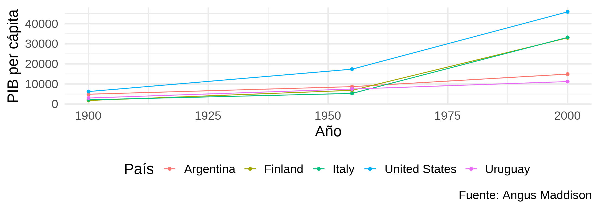
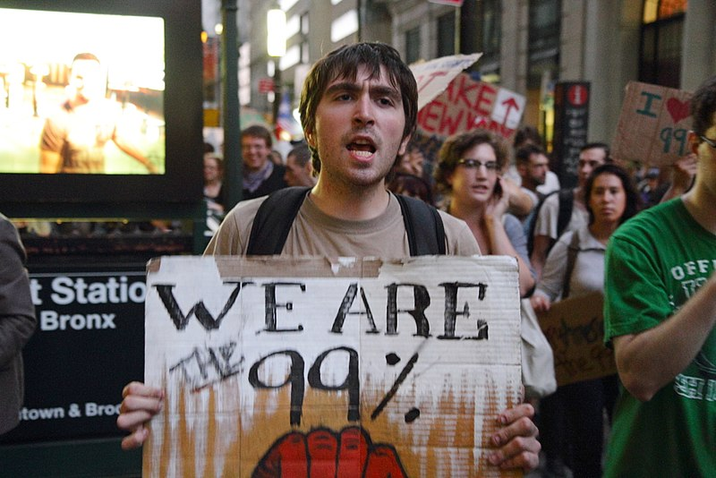
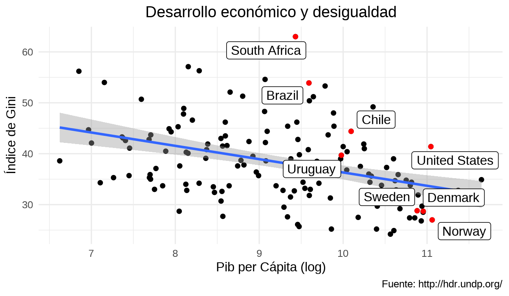

## Bienestar

- El bienestar económico no se resume en una sola variable.
- Requiere mirar ingreso, salud, educación y distribución.

## Medición

- PIB per cápita
- Índice de Desarrollo Humano
- Pobreza
- Desigualdad

## PIB per cápita

- Es una medida útil de ingreso promedio.
- No capta directamente distribución, trabajo no remunerado o calidad ambiental.

## PIB per cápita en Uruguay

{.plain width="76%"}

## Problemas

- Promedia situaciones muy distintas.
- No muestra cómo se reparte el ingreso.

## El IDH

- Combina ingreso, salud y educación.

## Cálculo

- Esperanza de vida
- Escolaridad
- Ingreso

## Pobreza

- Puede medirse con enfoque monetario y con privaciones.

## La línea de pobreza

- Define un umbral mínimo de ingreso para cubrir necesidades básicas.

## Pobreza vs. indigencia

- La indigencia refiere a ingresos insuficientes incluso para una canasta alimentaria básica.

## Necesidades básicas insatisfechas

- Permite detectar privaciones no observables solo por ingreso.

## Pobreza en Uruguay

{.plain width="82%"}

## Pobreza en Uruguay (2)

<blockquote class="twitter-tweet">
<a href="https://twitter.com/hashtag/LaLetraChica?src=hash&amp;ref_src=twsrc%5Etfw">#LaLetraChica</a> Vigorito: "Hay un desafío que es pasar de un concepto de pobreza, que lo relevante que tiene es que por detrás está la discusión de los fines últimos de una sociedad determinada y qué condiciones mínimas de vida debería tener una persona en esa sociedad".
&mdash; laletrachicatv (@laletrachicatv) <a href="https://twitter.com/laletrachicatv/status/1308561264579411968?ref_src=twsrc%5Etfw">September 23, 2020</a></blockquote>

## Distribución del ingreso

- No alcanza con saber cuánto produce una economía.
- También importa cómo se reparte ese ingreso.

## Medición de la desigualdad

- Participación por deciles
- Curva de Lorenz
- Índice de Gini

## Participación por decil

{.plain width="82%"}

## Curva de Lorenz

- Compara la distribución observada con la igualdad perfecta.

## Comparación de curvas de Lorenz

{.plain width="82%"}

## Índice de Gini

- Resume desigualdad en un número entre 0 y 1.

## Gini mundial

{.plain width="82%"}

## Ingreso y desigualdad

- El crecimiento no garantiza menor desigualdad.

## Casos interesantes

- Países ricos desiguales
- Países de ingreso medio más igualitarios

## Causas de las desigualdades económicas

- Educación
- Herencia
- Instituciones
- Tecnología
- Poder de mercado

## Cambio tecnológico

- Puede aumentar la demanda relativa de trabajo calificado.

## Redistribución de la riqueza

- Impuestos
- Transferencias
- Servicios públicos
