## Elasticidad precio de la demanda

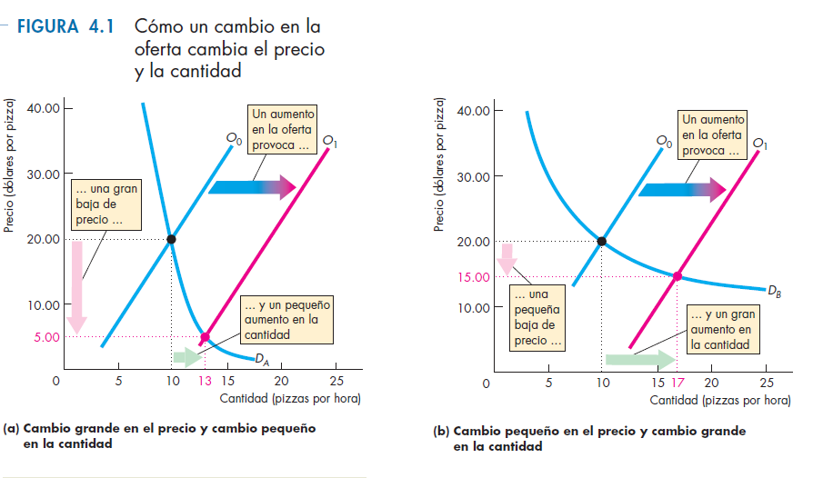{.plain width="88%"}

## Elasticidad precio de la demanda

- Ya sabemos que si el precio sube, la cantidad demandada baja.
- La elasticidad precio de la demanda ($E_d$) cuantifica esa caída.
- Mide cuánto cambia la cantidad demandada cuando cambia el precio.

$$E_d = \left| \frac{\Delta Q \%}{\Delta P \%} \right|$$

## Elasticidad precio de la demanda (2)

- La elasticidad de la demanda depende de varios factores:
  - si el bien tiene muchos sustitutos, su demanda es más elástica;
  - en plazos largos, la demanda suele ser más elástica;
  - los bienes de lujo tienen demanda más elástica que los bienes de primera necesidad.

## Elasticidad precio de la demanda (3)

- Si $E_d = 1$, la demanda tiene elasticidad unitaria.
- Si $E_d > 1$, la demanda es elástica.
- Si $E_d < 1$, la demanda es inelástica.

## A tener en cuenta

- Usamos cambios porcentuales y no absolutos.
- Para calcular la variación porcentual usamos el promedio del valor inicial y final como denominador.
- Si no usamos valor absoluto, la elasticidad sería negativa.

$$\Delta P\% = \frac{\Delta P}{(P_0 + P_1)/2}$$

## Ejemplo numérico

:::: {.columns}
::: {.column width="62%"}
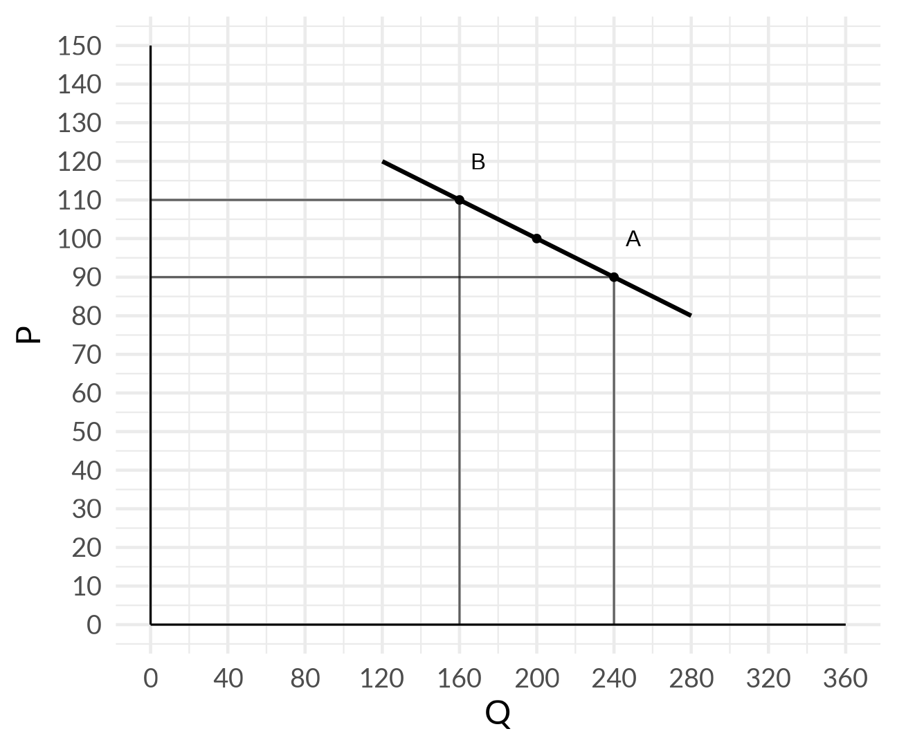{.plain width="100%"}
:::
::: {.column width="38%"}
- El precio pasa de 90 a 110.
- La cantidad pasa de 240 a 160.
:::
::::

## Ejemplo

### Variación absoluta

- La variación absoluta del precio es 20.
- La variación absoluta de la cantidad es 80.
- La variación porcentual del precio es 20%.
- La variación porcentual de la cantidad es 40%.

## Casos extremos

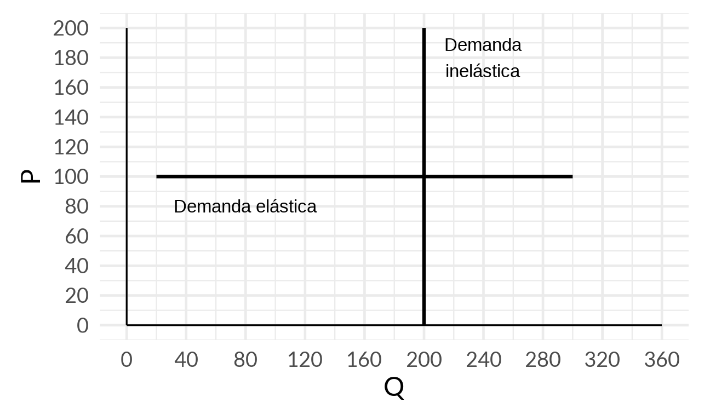{.plain width="72%"}

## La elasticidad y los ingresos de las empresas

- Si hay un aumento en la oferta, baja el precio y sube la cantidad.
- ¿Qué pasa con el ingreso de las empresas ($P \times Q$)?
- Depende de la elasticidad de la demanda.

## Elasticidad e ingresos

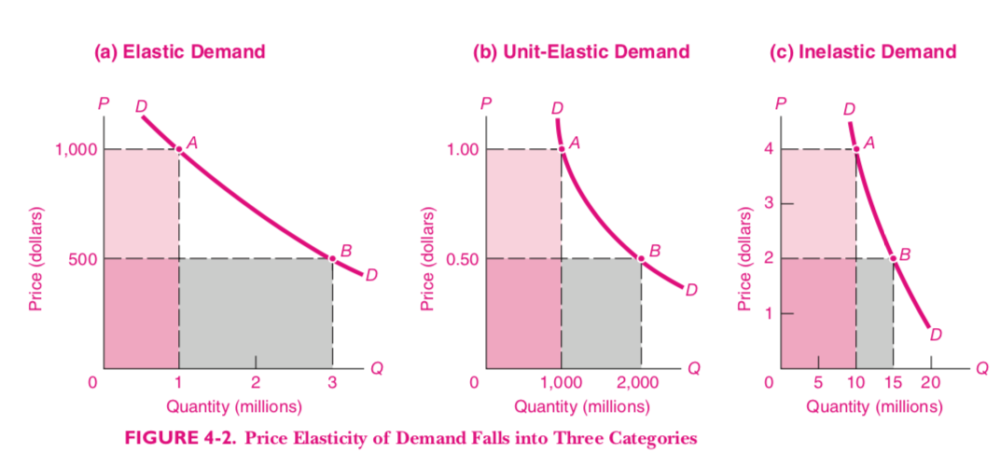{.plain width="88%"}

## Elasticidad e ingresos

- Si la demanda es elástica, el aumento en $Q$ es mayor que la caída en $P$ y el ingreso sube.
- Si la demanda es inelástica, el aumento en $Q$ es menor que la caída en $P$ y el ingreso cae.
- Si la elasticidad es unitaria, los cambios se compensan.

## Elasticidad ingreso del combustible

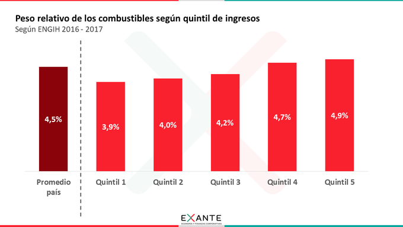{.plain width="86%"}

## Elasticidad ingreso de la demanda de combustibles

- El quintil más pobre de los hogares uruguayos gasta 3,9% de sus ingresos en combustible.
- El quintil más rico gasta 4,9%.
- Cuando aumenta el ingreso, la participación del combustible en el presupuesto aumenta.

## Elasticidad ingreso de la demanda de alimentos

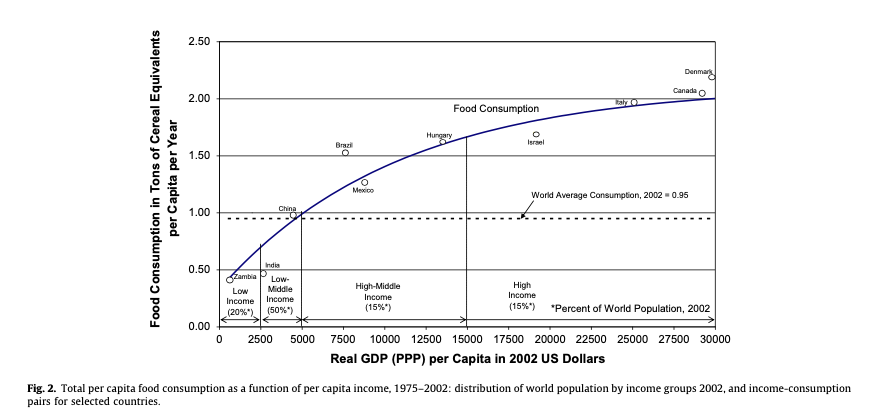{.plain width="84%"}

## Elasticidad ingreso de los alimentos

- A medida que los países se hacen más ricos, su gasto en alimentos aumenta.
- Pero la participación de los alimentos en el gasto total decrece.

## Mecanismos de asignación de recursos

- Precios
- Control centralizado
- Votación
- Concurso
- Orden de llegada
- Sorteo
- Características personales

## La demanda y la disposición a pagar

- La curva de demanda indica cuántas unidades de un bien se comprarían a determinado precio.

## Disposición a pagar (1)

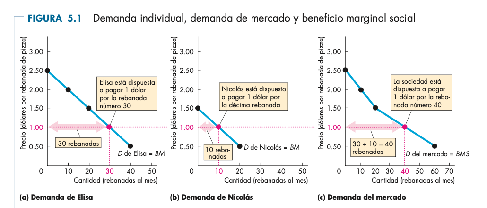{.plain width="86%"}

## Disposición a pagar (2)

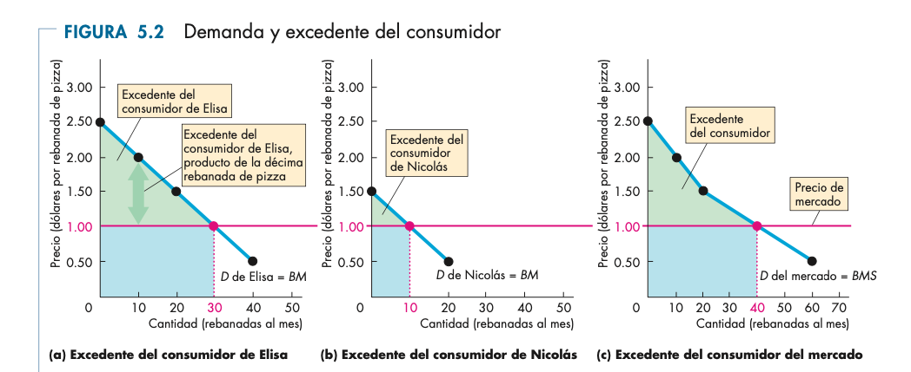{.plain width="86%"}

## Excedente del productor (1)

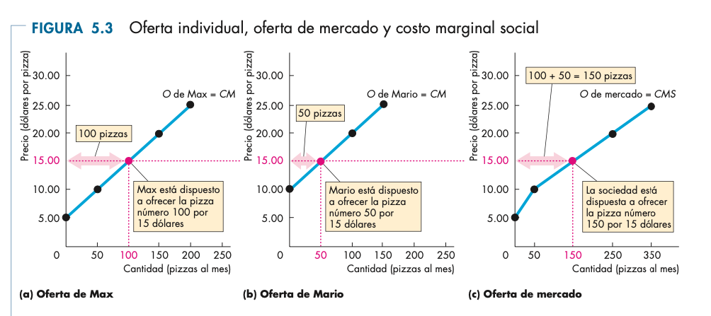{.plain width="86%"}

## Excedente del productor (2)

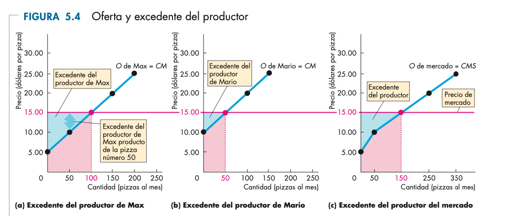{.plain width="86%"}

## Equilibrio y excedentes

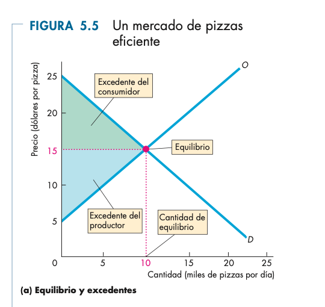{.plain width="86%"}

## Equilibrio y eficiencia

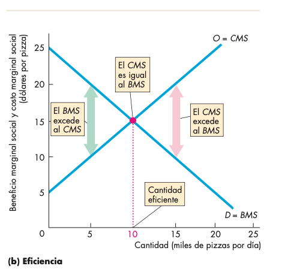{.plain width="86%"}

## Sobreproducción

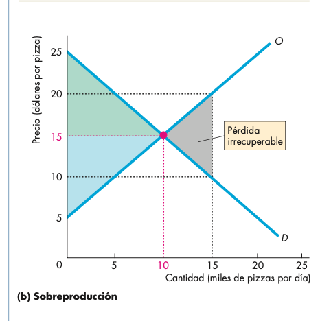{.plain width="86%"}

## Subproducción

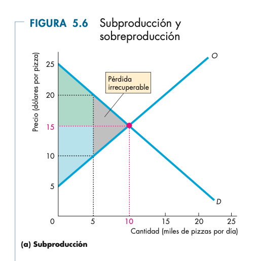{.plain width="86%"}

## El excedente del consumidor

- La curva de demanda representa la disposición a pagar.
- El precio de equilibrio se determina en el cruce con la curva de oferta.
- Las primeras unidades compradas generan mayor satisfacción que las últimas.
- Todas las unidades se venden al mismo precio.

## Usos

- El excedente del consumidor se calcula como el área entre el precio y la curva de demanda.
- Si la curva de demanda es lineal, es un triángulo.
- Sirve para medir bienestar y efectos de políticas económicas.

## Aplicación a controles de precios

:::: {.columns}
::: {.column width="64%"}
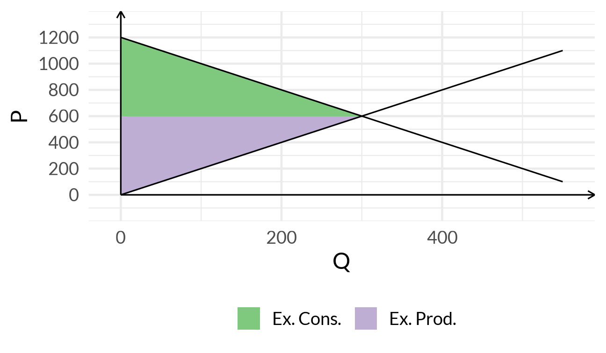{.plain width="100%"}
:::
::: {.column width="36%"}
| Concepto | Valor |
|---|---:|
| Excedente del productor | 90000 |
| Excedente del consumidor | 90000 |
| Recaudación | 0 |
| Total | 180000 |
:::
::::

## Controles de precios

:::: {.columns}
::: {.column width="64%"}
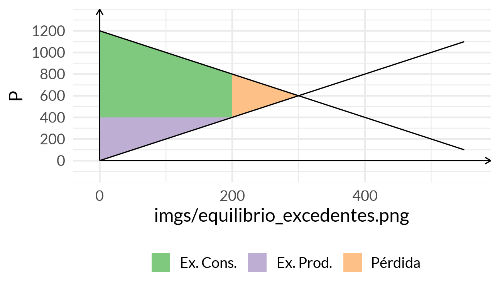{.plain width="100%"}
:::
::: {.column width="36%"}
| Concepto | Valor |
|---|---:|
| Excedente del productor | 40000 |
| Excedente del consumidor | 120000 |
| Total | 160000 |

- Pérdida de bienestar: 20000
:::
::::

## Efecto de un impuesto

- Incidencia legal vs. incidencia económica.
- A veces los productores pueden trasladar el peso del impuesto a los consumidores.
- Depende de las elasticidades relativas de oferta y demanda.

## Análisis económico

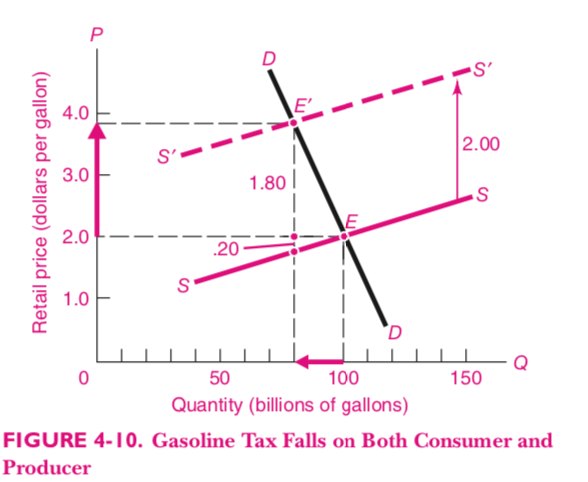{.plain width="88%"}

## Análisis económico (2)

- El equilibrio inicial tiene precio 2 y 100 billones de galones vendidos.
- El impuesto desplaza la oferta hacia la izquierda por 2.
- El nuevo equilibrio implica un precio mayor para consumidores y una cantidad menor.

## Impuesto sobre los consumidores

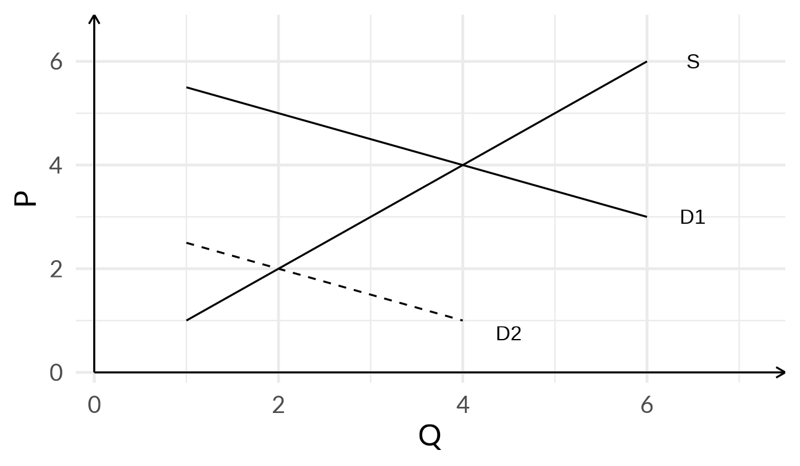{.plain width="78%"}

## Impuesto sobre los productores

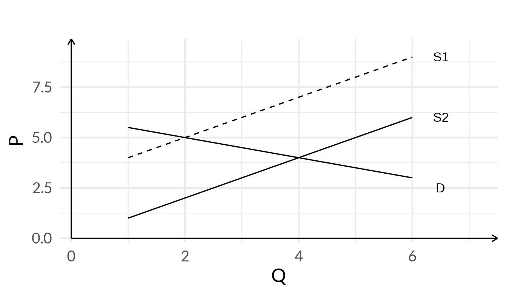{.plain width="78%"}

## Bienestar antes del impuesto

| Concepto | Valor |
|---|---:|
| Excedente del productor | 8 |
| Excedente del consumidor | 4 |
| Recaudación | 0 |
| Total | 12 |

## Bienestar después del impuesto

| Concepto | Valor |
|---|---:|
| Excedente del productor | 2 |
| Excedente del consumidor | 1 |
| Recaudación | 6 |
| Total | 9 |

Hay una pérdida de bienestar de 3.

## Conclusiones

- El equilibrio de mercado es el mismo independientemente de si el impuesto recae legalmente en consumidores o productores.
- La incidencia económica del impuesto no depende de quién lo paga según la ley, sino de las elasticidades de oferta y demanda.

## Cierre

<blockquote class="twitter-tweet">

"En inserción internacional parece que Uruguay está buscando pareja en el baile", señaló Rosselli. En el último desayuno de trabajo organizado por <a href="https://twitter.com/Exante_UY?ref_src=twsrc%5Etfw">@Exante_UY</a> sobre perspectivas económicas del Uruguay se planteó la necesidad de impulsar una agenda ambiciosa de reformas.
&mdash; Desayunos informales (@desayunos12) <a href="https://twitter.com/desayunos12/status/1521851873959063552?ref_src=twsrc%5Etfw">May 4, 2022</a>
</blockquote>

