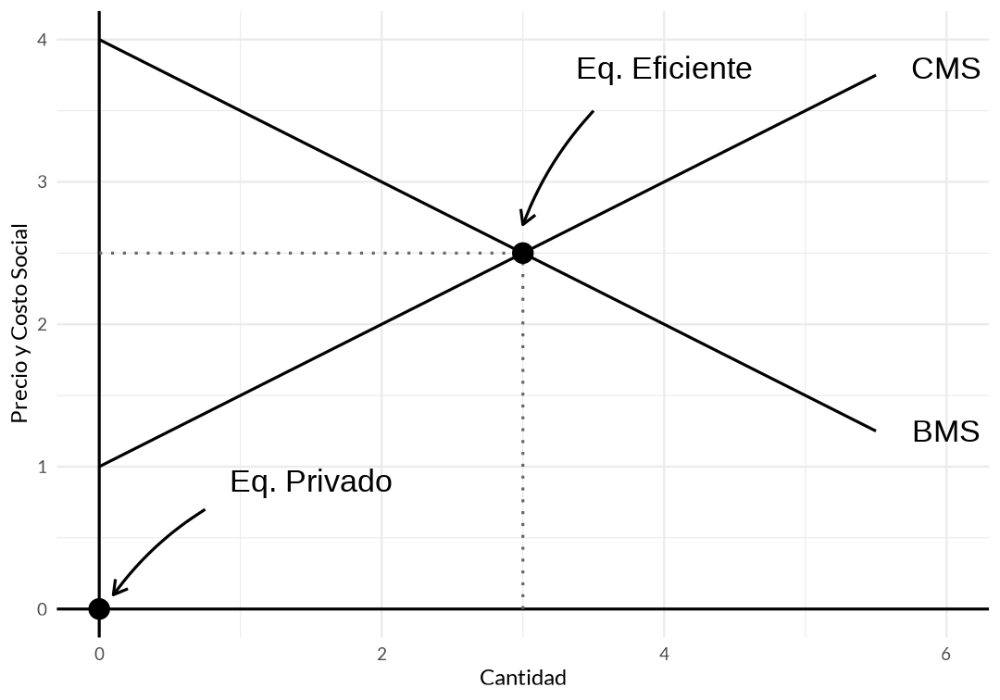
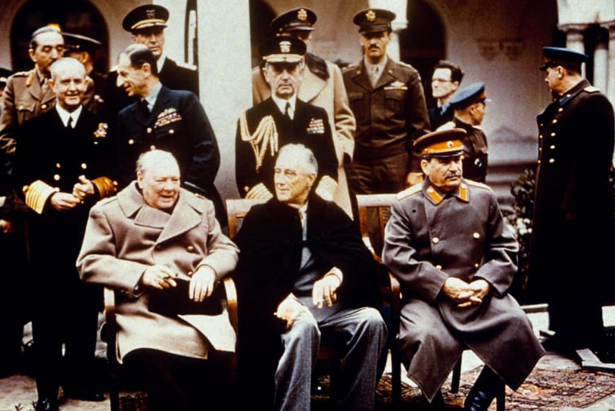
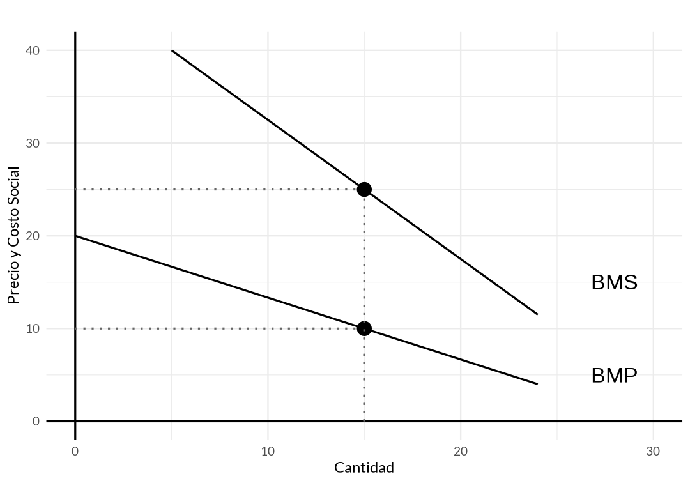
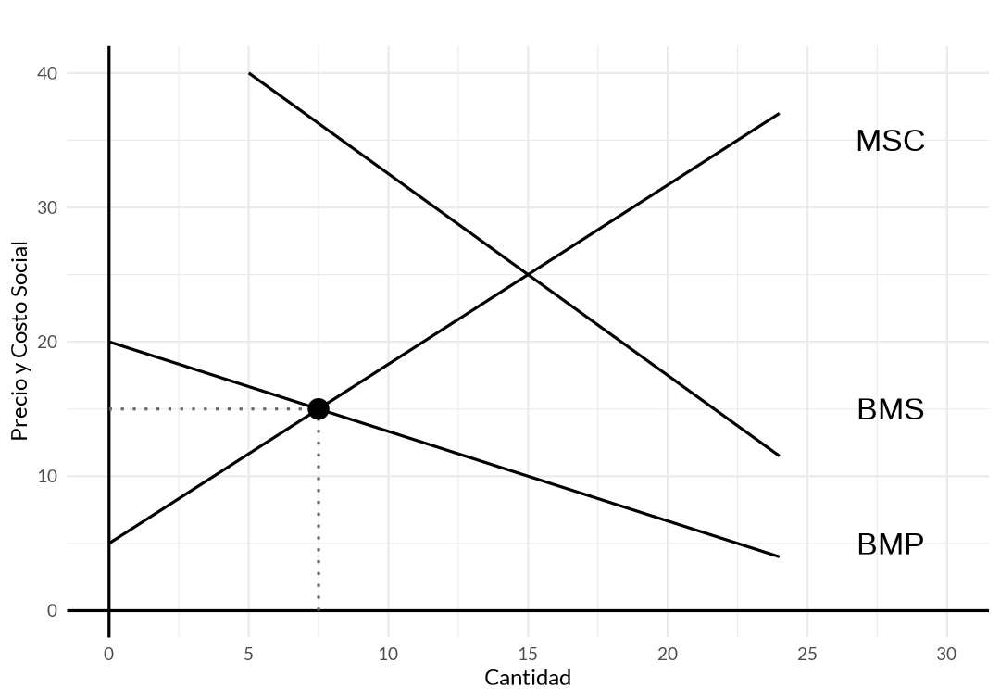
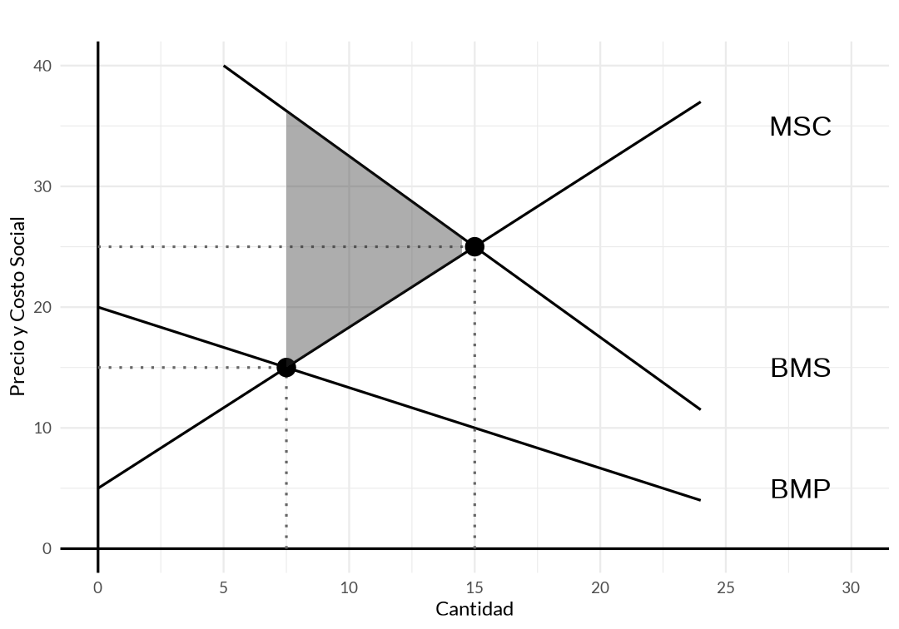
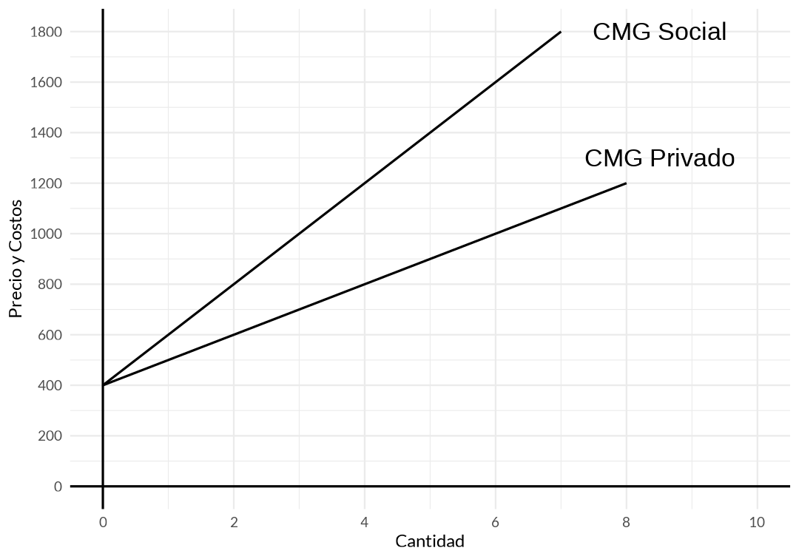
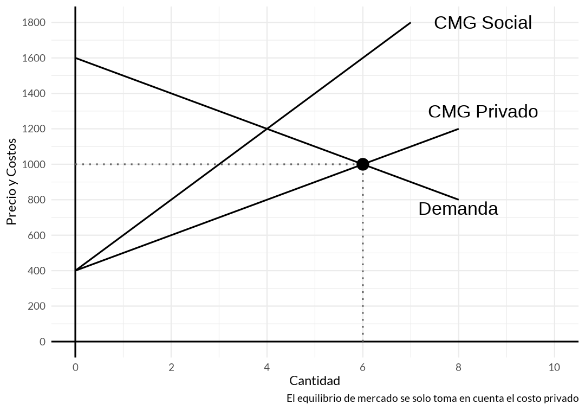
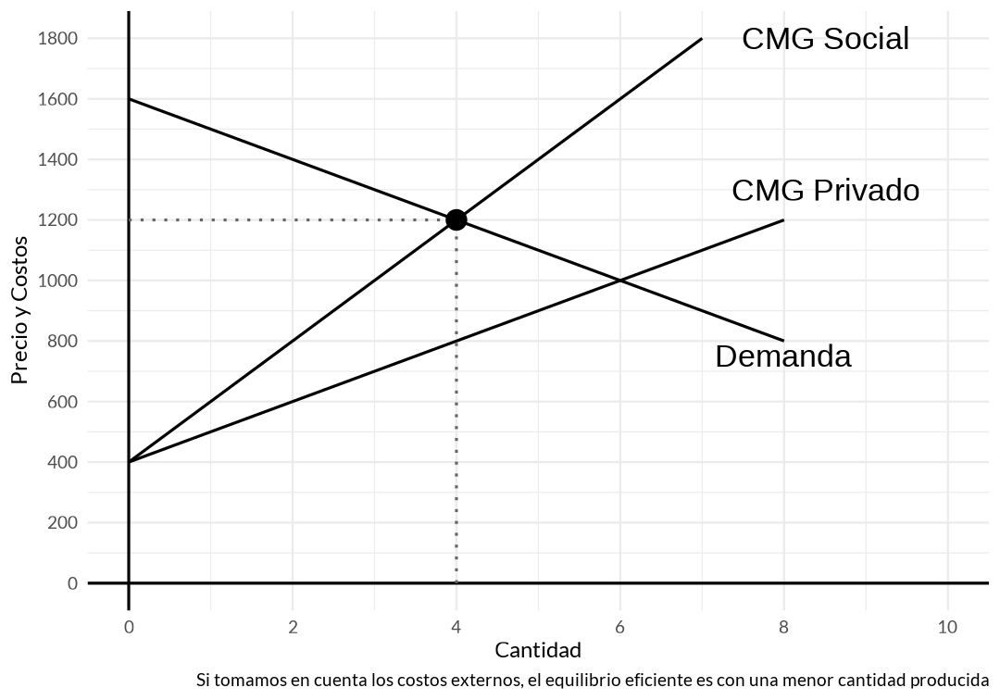
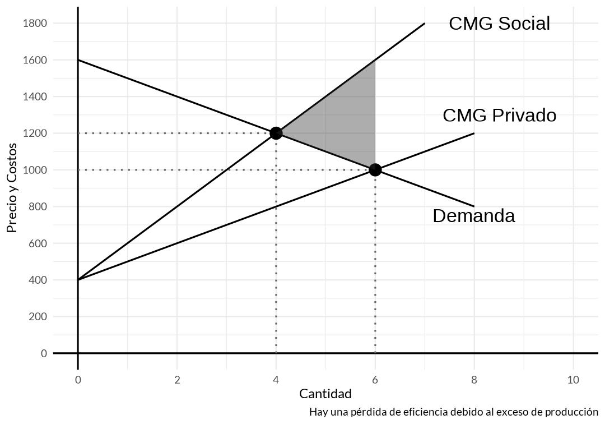

## ¿Por qué existen los gobiernos?

- Para responder cuando los mercados no generan resultados eficientes o equitativos.
- Para proveer bienes públicos y corregir externalidades.

## Bienes públicos

- Son bienes no rivales y no excluibles.
- El consumo de una persona no reduce necesariamente el de otra.
- Es difícil impedir el acceso una vez provistos.

## Externalidades y bienes mixtos

- Las externalidades aparecen cuando una acción afecta a terceros sin pasar por precios.
- Los bienes mixtos combinan rasgos privados y públicos.

## Ineficiencias

- Los mercados pueden producir de más o de menos respecto del nivel socialmente deseable.

## Free riders y bienes públicos

- Si no se puede excluir, algunas personas consumen sin pagar.
- Eso debilita los incentivos privados a proveer el bien.

## Provisión de bienes públicos

{.plain width="82%"}

## Estudio de caso

{.plain width="84%"}

## Bienes mixtos

- Educación
- Salud
- Infraestructura
- Investigación

## Beneficio privado y social

- El beneficio social puede ser mayor que el privado cuando hay externalidades positivas.

## Mercado de educación terciaria

{.plain width="82%"}

## Mercado de educación terciaria (2)

{.plain width="82%"}

## Equilibrio ineficiente

- Cuando el beneficio social excede el privado, el mercado subproduce.

## Pérdida de eficiencia

{.plain width="82%"}

## Solución eficiente

- Subsidios
- Regulación
- Provisión pública

## Externalidades negativas

- La actividad privada impone costos a terceros.
- El equilibrio de mercado no incorpora ese costo externo.

## Valorando costos externos

{.plain width="82%"}

## Análisis

- Comparar equilibrio privado y equilibrio social.
- Identificar pérdida de eficiencia.

## Equilibrio de mercado

{.plain width="82%"}

## Equilibrio eficiente

{.plain width="82%"}

## Pérdida de eficiencia

{.plain width="82%"}

## Equilibrio eficiente con un impuesto

{.plain width="82%"}

## Impuesto

- Un impuesto pigouviano busca igualar el costo privado al costo social.

## Recursos de propiedad común

- Son rivales pero difíciles de excluir.
- Pueden sufrir sobreexplotación.

## Agro Uruguay siglo XIX

{.plain width="82%"}

## Análisis

- Identificar el problema de incentivos.
- Evaluar soluciones institucionales posibles.
