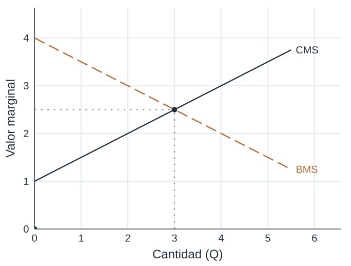
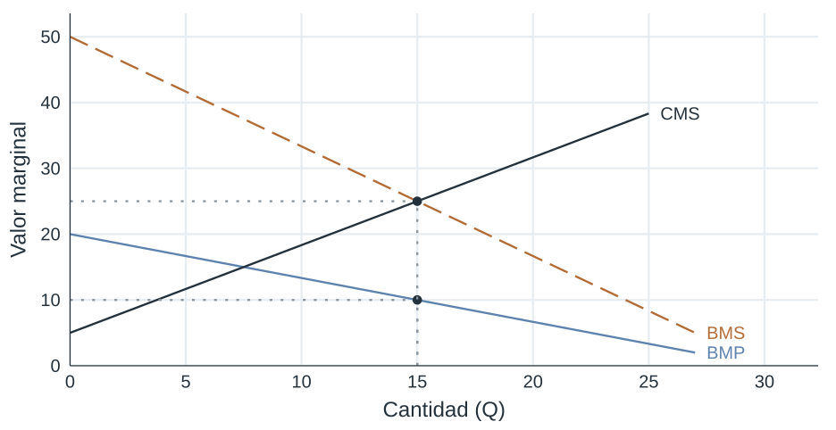
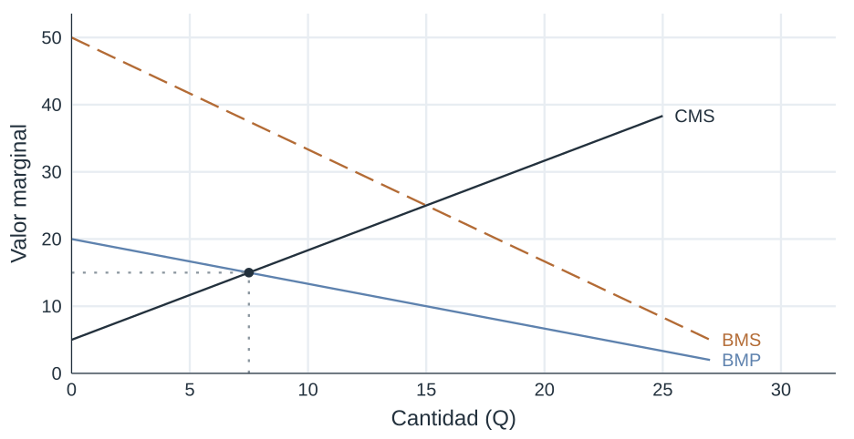
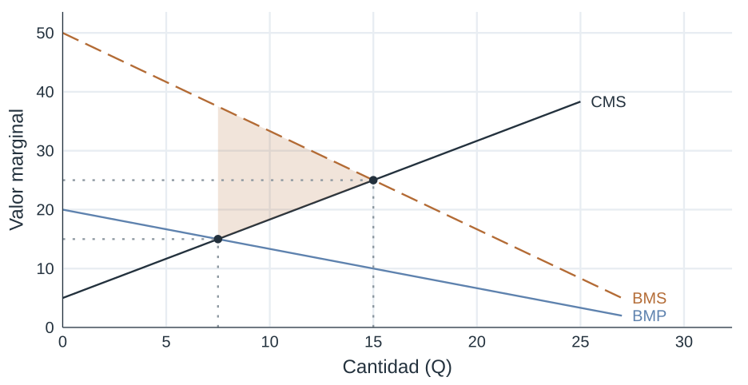
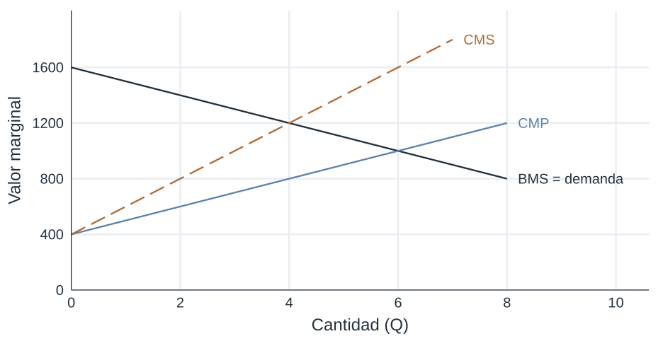
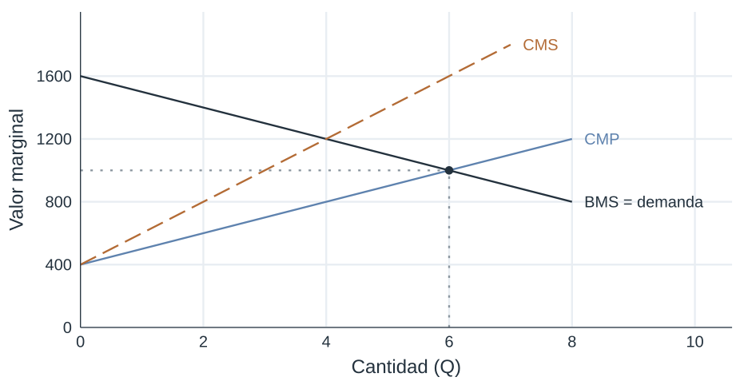
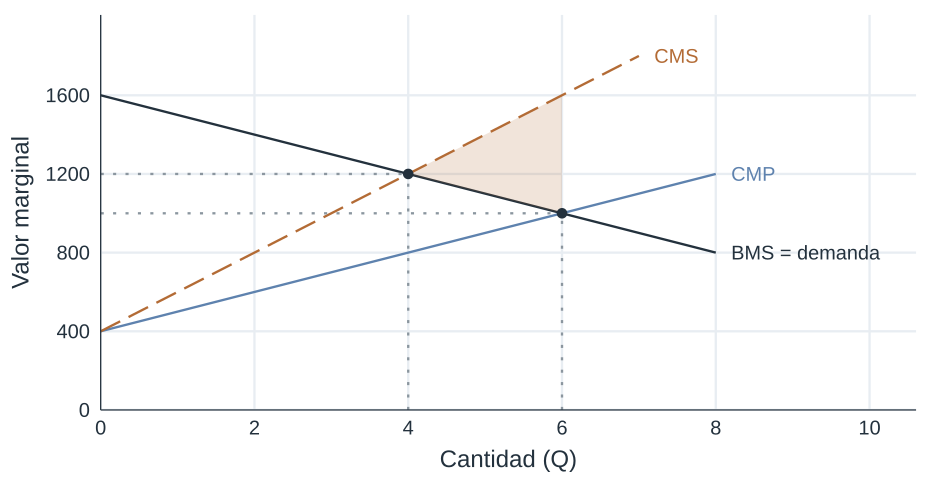
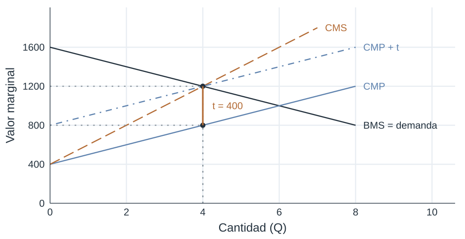

## ¿Por qué existen los gobiernos? {.course-slide}

Cuando los mercados no generan resultados __eficientes__ o __equitativos__.

## Bienes públicos {.course-slide}

- Son bienes no rivales y no excluibles.
- El consumo de una persona no reduce necesariamente el de otra.
- Es difícil impedir el acceso una vez provistos.

## Externalidades y bienes mixtos {.course-slide}

- Las externalidades aparecen cuando una acción afecta a terceros sin pasar por precios.
- Los bienes mixtos combinan rasgos privados y públicos.

## Ineficiencias {.course-slide}

- Los mercados pueden producir de más o de menos respecto del nivel socialmente deseable.

## Free riders y bienes públicos {.course-slide}

- Si no se puede excluir, algunas personas consumen sin pagar.
- Eso debilita los incentivos privados a proveer el bien.

## Provisión de bienes públicos {.course-slide .public-good-slide}

::: {.split}
::: {.visual}
{.plain .nostretch fig-alt="El beneficio marginal social iguala el costo marginal social en Q = 3 y valor marginal = 2,5. La provisión privada nula es un supuesto de este ejemplo."}
:::

::: {.explanation}
**Cantidad eficiente**

**BMS = CMS** en **Q = 3**.

BMS: beneficio marginal social.

CMS: costo marginal social.

::: {.takeaway}
En este ejemplo se supone **provisión privada nula** por el problema del polizón (*free rider*).
:::
:::
:::

## Estudio de caso {.photo-slide .photo-title-only background-image="imgs/yalta.png" background-size="cover" background-position="center 65%" background-color="#e8e5df"}

## Bienes mixtos {.course-slide}

- Educación
- Salud
- Infraestructura
- Investigación

## Beneficio privado y social {.course-slide}

- El beneficio social puede ser mayor que el privado cuando hay externalidades positivas.

## Educación: beneficio privado y social {.course-slide}

::: {.visual}
{.plain .nostretch fig-alt="BMP y BMS difieren; en Q = 15 el beneficio privado es 10 y el social es 25."}
:::

::: {.takeaway}
BMS = BMP + beneficio marginal externo.
:::

## Educación: equilibrio de mercado {.course-slide}

::: {.visual}
{.plain .nostretch fig-alt="El equilibrio privado ocurre en Q = 7,5, con BMP = CMS = 15."}
:::

::: {.takeaway}
El mercado considera el beneficio privado: BMP = CMS.
:::

## Equilibrio ineficiente {.course-slide}

- Cuando el beneficio social excede el privado, el mercado subproduce.

## Educación: pérdida de eficiencia {.course-slide}

::: {.visual}
{.plain .nostretch fig-alt="El mercado produce 7,5 frente al óptimo social de 15. Se sombrea la diferencia entre BMS y CMS en las unidades no producidas."}
:::

::: {.takeaway}
Entre Q = 7,5 y Q = 15, el beneficio social supera el costo de producir.
:::

## Solución eficiente {.course-slide}

- Subsidios
- Regulación
- Provisión pública

## Contaminación: costos para terceros {.photo-slide background-image="imgs/cianobacterias-01.jpeg" background-size="cover" background-position="center" background-color="#e8e5df"}

::: {.photo-copy}
¿Quién obtiene los beneficios de una actividad y quién soporta sus costos externos?
:::

## Externalidades negativas {.course-slide}

- La actividad privada impone costos a terceros.
- El equilibrio de mercado no incorpora ese costo externo.

## Costos privados y sociales {.course-slide}

::: {.visual}
{.plain .nostretch fig-alt="Demanda, costo marginal privado y costo marginal social. El costo externo es la distancia entre CMS y CMP."}
:::

::: {.takeaway}
CMS = CMP + costo marginal externo.
:::

## Análisis {.course-slide}

- Comparar equilibrio privado y equilibrio social.
- Identificar pérdida de eficiencia.

## Externalidad negativa: equilibrio de mercado {.course-slide}

::: {.visual}
{.plain .nostretch fig-alt="La demanda cruza CMP en Q = 6 y precio = 1000."}
:::

::: {.takeaway}
El mercado produce Q = 6 porque considera el costo privado.
:::

## Externalidad negativa: equilibrio eficiente {.course-slide}

::: {.visual}
{.plain .nostretch fig-alt="La demanda cruza CMS en Q = 4 y beneficio marginal = 1200."}
:::

::: {.takeaway}
La cantidad eficiente es Q = 4: BMS = CMS.
:::

## Externalidad negativa: pérdida de eficiencia {.course-slide}

::: {.visual}
{.plain .nostretch fig-alt="Se sombrea el exceso de costo social sobre beneficio social entre Q = 4 y Q = 6."}
:::

::: {.takeaway}
Las unidades entre Q = 4 y Q = 6 cuestan más a la sociedad de lo que aportan.
:::

## Un impuesto lleva a la cantidad eficiente {.course-slide}

::: {.visual}
{.plain .nostretch fig-alt="Un impuesto de 400 desplaza CMP hacia arriba. En Q = 4 los consumidores pagan 1200 y los productores reciben 800."}
:::

::: {.takeaway}
Con t = 400, Q = 4; consumidores pagan 1200 y productores reciben 800.
:::

## Impuesto {.course-slide}

- El impuesto pigouviano iguala el costo marginal externo en la cantidad eficiente.
- En este ejemplo: $t = CMS(4) - CMP(4) = 1200 - 800 = 400$.

## Recursos de propiedad común {.course-slide}

- Son rivales pero difíciles de excluir.
- Pueden sufrir sobreexplotación.

## Agro Uruguay siglo XIX {.photo-slide .photo-title-only background-image="imgs/alambrado.png" background-size="cover" background-position="center" background-color="#e8e5df"}

## Análisis {.course-slide}

- Identificar el problema de incentivos.
- Evaluar soluciones institucionales posibles.
