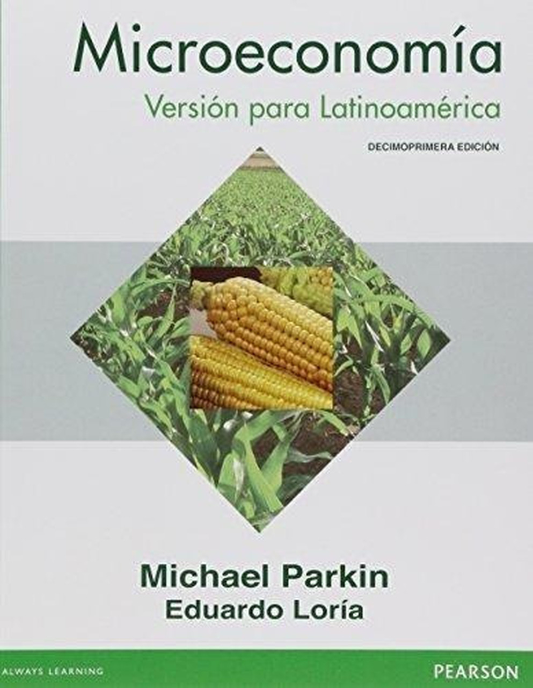
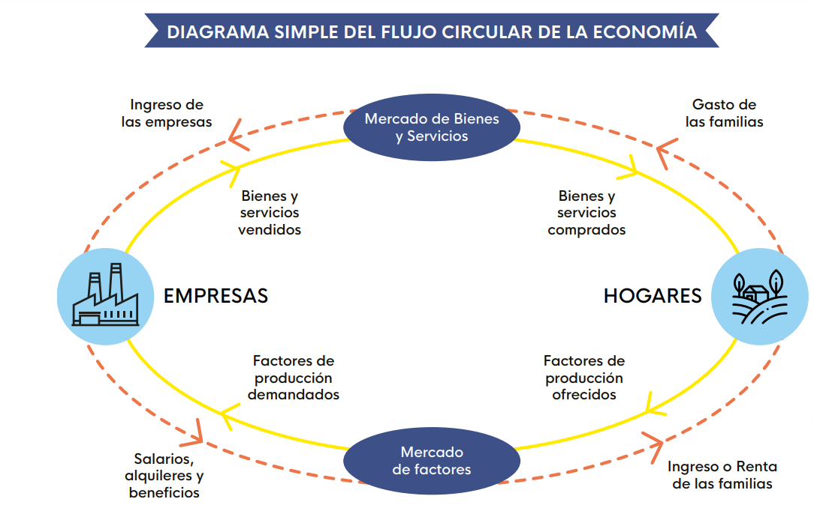

## Horarios

- Jueves 9:10 - 9:50
- Viernes 7:45 - 9:05

## Rafael La Buonora

- [Web](https://rlabuonora.com)
- Economista
  - Ministerio de Industria
  - Ministerio de Economía
  - Oficina de Planeamiento y Presupuesto
- Docente
  - Universidad de la República
  - Secundaria

## Objetivos del curso

- Presentar las principales herramientas de la economía.
- Dar un panorama de qué hacen los economistas.

## Recursos

:::: {.columns}
::: {.column width="58%"}
- [Sitio web](https://econ.rlabuonora.com)
  - Ejercicios
  - Notas de clase
  - Libro
:::
::: {.column width="42%"}
{.plain width="85%"}
:::
::::

## Evaluación

- Participación en clase (50%)
- Pruebas escritas (50%)
  - 2 escritos
  - 2 parciales

## ¿Qué estudia la economía?

- ¿Por qué algunos países son más ricos que otros?
- ¿Cómo se determina el salario de los trabajadores?
- ¿Qué medidas debe tomar el gobierno para mejorar el bienestar de la población?
- ¿A quién beneficia una política económica?

## Contenido del curso

:::: {.columns}
::: {.column width="50%"}
### Microeconomía

- Consumidores
- Productores
- Mercados
- Mercado de trabajo
- Distribución del ingreso
:::
::: {.column width="50%"}
### Macroeconomía

- Actividad económica
- Desempleo
- Inflación
- Dólar y comercio exterior
:::
::::

## Problemas económicos de la sociedad

- ¿Qué producir? Economías con estructuras productivas diferentes.
- ¿Cómo producir? Economías disponen de diferentes tecnologías.
- ¿Para quién producir? Distribución del producto de la economía.

## Economía positiva y normativa

- La economía positiva describe la realidad.
- La economía normativa aplica juicios de valor.
- ¿Es posible separarlas?

## Economías mixtas

- Las economías modernas son economías mixtas.
- Combinan dos mecanismos para asignar recursos:
  - El mercado
  - El Estado

## El mercado {background-image="imgs/mercado.jpg" background-position="95% 70%" background-size="36%"}

:::: {.columns}
::: {.column width="58%"}
- Reúne compradores y vendedores.
- Coordina millones de agentes de forma descentralizada.
- Determina el precio de un bien y la cantidad vendida.
:::
::: {.column width="42%"}
:::
::::

## Mercado y precios {background-image="imgs/smith.jpg" background-position="94% 65%" background-size="30%"}

:::: {.columns}
::: {.column width="60%"}
- Adam Smith fue el primero en entender su importancia.
- Los precios son señales para que los agentes tomen decisiones.
- Determinan qué, cómo y para quién se produce.
:::
::: {.column width="40%"}
:::
::::

## El mercado

- No hay un individuo o empresa responsable de "hacer funcionar" los mercados.
- Hay mercados de muchos tipos: centralizados, descentralizados y electrónicos.
- Su rol es determinar precios y cantidades.
- Esos precios sirven como señales para coordinar la acción de los agentes.
- El equilibrio de mercado es una combinación de precios y cantidades que balancea oferta y demanda.

## El mercado (2)

- Los mercados ayudan a responder:
  - ¿Qué producir? Si nadie compra algo, esa es una señal para reasignar recursos.
  - ¿Cómo producir? Una nueva tecnología será adoptada si mejora los resultados.
  - ¿Para quién producir? Los ingresos dependen de los precios de los factores que posee cada agente.

## El mercado (3)

- Las dos fuerzas principales son las preferencias y la tecnología.
- Las preferencias determinan qué combinaciones de bienes desean los consumidores.
- La tecnología determina los límites de producción posibles.

## El Estado {background-image="imgs/tabare.jpg" background-position="94% 65%" background-size="36%"}

:::: {.columns}
::: {.column width="58%"}
En una economía mixta, el Estado es necesario cuando:

- hay resultados ineficientes;
- hay resultados eficientes pero injustos;
- se busca estabilidad macroeconómica.
:::
::: {.column width="42%"}
:::
::::

## Competencia imperfecta {background-image="imgs/food.jpg" background-position="center 92%" background-size="58%"}

Los oferentes o los demandantes pueden tener poder de mercado.

## Externalidades positivas {background-image="imgs/innovation.jpg" background-position="94% 65%" background-size="34%"}

:::: {.columns}
::: {.column width="60%"}
- La actividad económica genera efectos que no se reflejan en los precios.
- Esos efectos pueden impactar positivamente en agentes que no participan en la transacción.
:::
::: {.column width="40%"}
:::
::::

## Externalidades negativas {background-image="imgs/pollution.jpg" background-position="94% 65%" background-size="34%"}

:::: {.columns}
::: {.column width="60%"}
- La actividad económica genera efectos que no se reflejan en los precios.
- Esos efectos pueden impactar negativamente en agentes que no participan en la transacción.
:::
::: {.column width="40%"}
:::
::::

## Bienes públicos {background-image="imgs/ejercito.jpeg" background-position="94% 65%" background-size="35%"}

:::: {.columns}
::: {.column width="58%"}
- No es posible excluir personas de su consumo.
:::
::: {.column width="42%"}
:::
::::

## Desigualdad {background-image="imgs/distribucion.jpg" background-position="94% 65%" background-size="35%"}

:::: {.columns}
::: {.column width="58%"}
- Algunos resultados pueden ser eficientes pero injustos.
:::
::: {.column width="42%"}
:::
::::

## Estabilidad macroeconómica {background-image="imgs/mef.png" background-position="94% 65%" background-size="34%"}

El nivel de actividad, el empleo y el nivel general de precios.

- Política fiscal: Ministerio de Economía.

## Estabilidad macroeconómica {background-image="imgs/bcu.jpg" background-position="94% 65%" background-size="34%"}

El nivel de actividad, el empleo y el nivel general de precios.

- Política monetaria: Banco Central.

## Método

- La economía como ciencia.
- La matemática como lenguaje de la ciencia.

## Variables

- Las ventas de una empresa: precios, cantidades y ventas.
- La cantidad de empleos en una economía.
- El valor de las exportaciones de un país.

## Ecuaciones

$$Beneficios = Ingresos - Costos$$

$$Consumo = f(Ingreso)$$

## Funciones

$$Producción = f(Trabajadores)$$

$$Demanda = Q_d(Precio, Ingresos, \ldots)$$

## Funciones (2) {background-image="imgs/risk.png" background-position="center 88%" background-size="72%"}

- Las funciones permiten entender la relación entre variables.

## Datos y gráficas (1) {background-image="imgs/serie_1.jpg" background-position="center 88%" background-size="62%"}

## Datos y gráficas (2) {background-image="imgs/pib-exante.jpeg" background-position="center 88%" background-size="78%"}

## Datos y gráficas (3) {background-image="imgs/dolar-exante.png" background-position="center 88%" background-size="78%"}

## Datos y gráficas (4) {background-image="imgs/puntos_1.png" background-position="center 86%" background-size="54%"}

## El diagrama del flujo circular

:::: {.columns}
::: {.column width="44%"}
- Es un mapa de cómo se relacionan los agentes de la economía.
- Aparecen los hogares y las empresas.
- Se vinculan a través de dos mercados.
:::
::: {.column width="56%"}
{.plain width="100%"}
:::
::::
