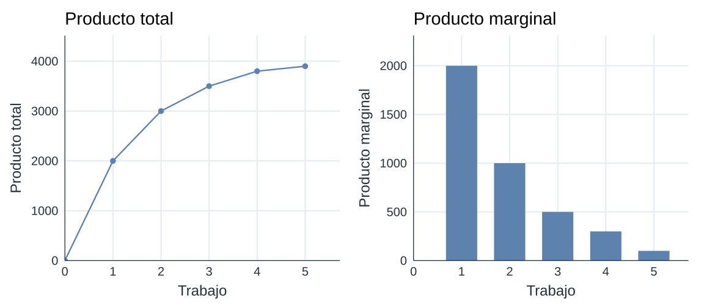
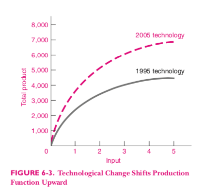
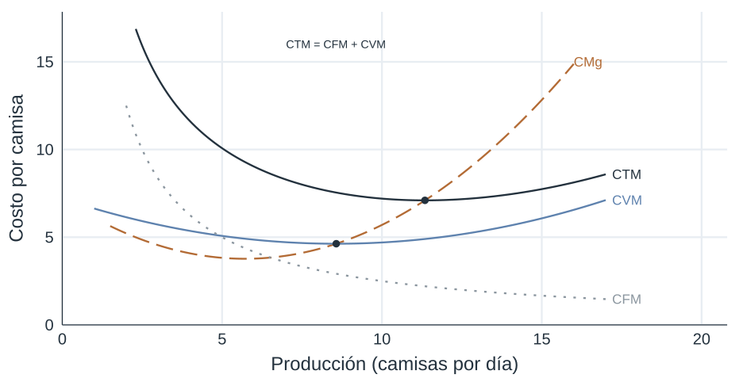
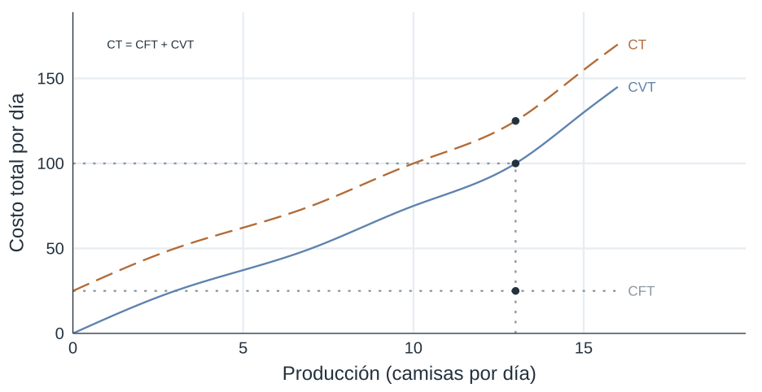
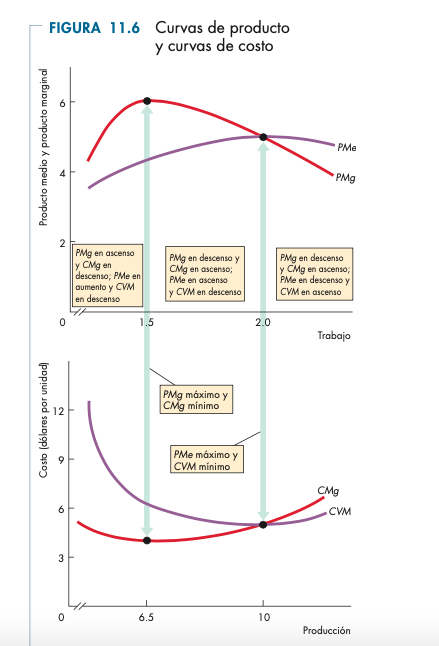
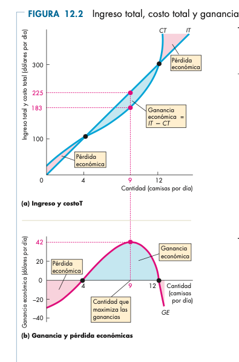

## Las capacidades productivas de la sociedad

- La economía combina trabajo, capital, tierra y organización.
- Las empresas coordinan esos factores para producir bienes y servicios.
- El problema central es cómo transformar insumos en productos de manera rentable.

## Las empresas

- Una empresa es una organización que produce para vender.
- Decide qué producir, cómo producir y cuánto producir.
- Su objetivo económico básico es maximizar beneficios.

## Maximización de beneficios

$$Beneficios = Ingresos - Costos$$

- Los ingresos dependen del precio y la cantidad vendida.
- Los costos dependen de la tecnología y del uso de factores.

## Algunos conceptos

- Producto total
- Producto marginal
- Rendimientos marginales decrecientes
- Retornos a escala
- Cambio tecnológico

## La función de producción

- Resume la relación entre insumos y producto.
- Permite estudiar qué ocurre cuando agregamos más trabajo o más capital.
- Ayuda a separar efectos de corto plazo y de largo plazo.

## Función de producción {.course-slide}

::: {.visual}
{.plain .nostretch width="82%"}
:::

## Rendimientos marginales decrecientes

- A medida que agregamos más de un factor variable, el producto marginal tiende a caer.
- Esto no implica que el producto total deje de aumentar de inmediato.
- Sí implica que cada unidad adicional aporta menos que la anterior.

## Retornos a escala

- Miden qué pasa cuando todos los factores aumentan simultáneamente.
- Pueden ser crecientes, constantes o decrecientes.
- Son un concepto distinto del rendimiento marginal.

## Cambio tecnológico {.course-slide}

::: {.visual}
{.plain .nostretch fig-alt="Comparación de funciones de producción antes y después de una mejora tecnológica."}
:::

::: {.takeaway}
Una mejora tecnológica permite producir más con los mismos insumos.
:::

## Medición de la productividad

- Productividad media
- Productividad marginal
- Productividad total de los factores

## Costos

- Costo fijo
- Costo variable
- Costo total
- Costo medio
- Costo marginal

## Plazos cortos y largos

- En el corto plazo, algunos factores son fijos.
- En el largo plazo, todos los factores pueden variar.
- Esta distinción es clave para entender la forma de las curvas de costo.

## Costo fijo y variable

- El costo fijo no cambia con la producción en el corto plazo.
- El costo variable sí cambia cuando cambia la cantidad producida.
- La suma de ambos da el costo total.

## Ejemplo

| q | CF | CV | CT |
|---:|---:|---:|---:|
| 0 | 55 | 0 | 55 |
| 1 | 55 | 30 | 85 |
| 2 | 55 | 55 | 110 |
| 3 | 55 | 75 | 130 |
| 4 | 55 | 105 | 160 |
| 5 | 55 | 155 | 210 |
| 6 | 55 | 225 | 280 |

## Costo marginal

- El costo marginal es el costo de producir una unidad adicional.
- Se relaciona con la productividad marginal del factor variable.
- Cuando la productividad marginal cae, el costo marginal sube.

## Ejemplo numérico

| q | CT | CMg |
|---:|---:|---:|
| 0 | 55 | |
| 1 | 85 | 30 |
| 2 | 110 | 25 |
| 3 | 130 | 20 |
| 4 | 160 | 30 |
| 5 | 210 | 50 |

## Costo medio

- El costo medio es el costo total dividido por la cantidad producida.
- Puede descomponerse en costo fijo medio y costo variable medio.

## Costo fijo medio, costo variable medio

- $CFMe = CF/q$ disminuye al repartir el costo fijo entre más unidades.
- $CVMe = CV/q$ depende de la productividad de los factores variables.

## Costos medios, fijos y marginales {.course-slide}

::: {.visual}
{.plain .nostretch width="82%"}
:::

## Costos medios, fijos y marginales (2) {.course-slide}

::: {.visual}
{.plain .nostretch width="82%"}
:::

## Productividad marginal y costos {.course-slide}

:::: {.split}
::: {.explanation}
- Al principio, la productividad marginal aumenta y el costo marginal baja.
- Cuando el factor fijo se satura, la productividad marginal cae y el costo marginal sube.
:::
::: {.visual}
{.plain .nostretch fig-alt="Producto total y marginal, y sus relaciones con las curvas de costo variable total y costo marginal."}
:::
::::

## Costos y maximización de beneficio {.course-slide}

:::: {.split}
::: {.explanation}
El beneficio se maximiza donde la distancia entre el ingreso total (IT) y el costo total (CT) es mayor.
:::
::: {.visual}
{.plain .nostretch fig-alt="Ingreso total, costo total y beneficio según la cantidad producida."}
:::
::::
