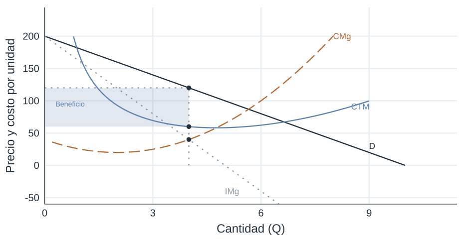

## Competencia imperfecta

- En muchos mercados, las empresas tienen poder para influir en el precio.
- Eso cambia la lógica de producción, precios y bienestar.

## Elasticidad de la demanda

- La capacidad de fijar precios depende de la respuesta de la cantidad demandada.
- Cuanto menos elástica la demanda, mayor poder de mercado.

## Tipos de competencia imperfecta

- Monopolio
- Oligopolio
- Competencia monopolística

## Monopolio

- Una sola empresa abastece todo el mercado.
- No hay sustitutos cercanos.
- Existen barreras a la entrada.

## Fuentes de imperfecciones de mercado

- Economías de escala
- Control de recursos clave
- Regulación
- Innovación y patentes

## Barreras a la entrada

- Impiden la competencia efectiva.
- Sostienen beneficios extraordinarios.

## Monopolio: ingreso marginal

- Para vender más, el monopolista suele bajar el precio.
- Por eso el ingreso marginal es menor que el precio.

## Ingreso marginal y precio

- Para vender una unidad adicional, el monopolista reduce el precio.
- La rebaja afecta también a las unidades que ya vendía.
- Por eso el ingreso marginal es menor que el precio.

## Ejemplo numérico

| q | P | Ingreso total | Ingreso marginal |
|---:|---:|---:|---:|
| 0 | 200 | 0 | |
| 1 | 180 | 180 | 180 |
| 2 | 160 | 320 | 140 |
| 3 | 140 | 420 | 100 |
| 4 | 120 | 480 | 60 |
| 5 | 100 | 500 | 20 |

## Ejemplo numérico (2)

| q | P | Ingreso total | Ingreso marginal |
|---:|---:|---:|---:|
| 6 | 80 | 480 | -20 |
| 7 | 60 | 420 | -60 |
| 8 | 40 | 320 | -100 |
| 9 | 20 | 180 | -140 |
| 10 | 0 | 0 | -180 |

## Elasticidad e ingreso marginal

- El ingreso marginal depende de la elasticidad de la demanda.
- Un monopolista no produce en el tramo inelástico de la demanda.

## Gráficamente {.course-slide}

::: {.visual}
{.plain .nostretch width="84%"}
:::

## Ingresos, beneficios y costos

- El monopolista elige la cantidad donde ingreso marginal iguala costo marginal.
- Luego fija el precio sobre la curva de demanda.

## Regulación de precios

- Los monopolios naturales suelen regularse.
- La regulación busca acercar el resultado a uno más eficiente.

## Grandes monopolios de la historia

- Casos clásicos de energía, ferrocarriles, telecomunicaciones y plataformas.

## Ejercicios

- Calcular cantidad, precio y beneficios.
- Comparar con competencia perfecta.
- Identificar pérdida de eficiencia.
