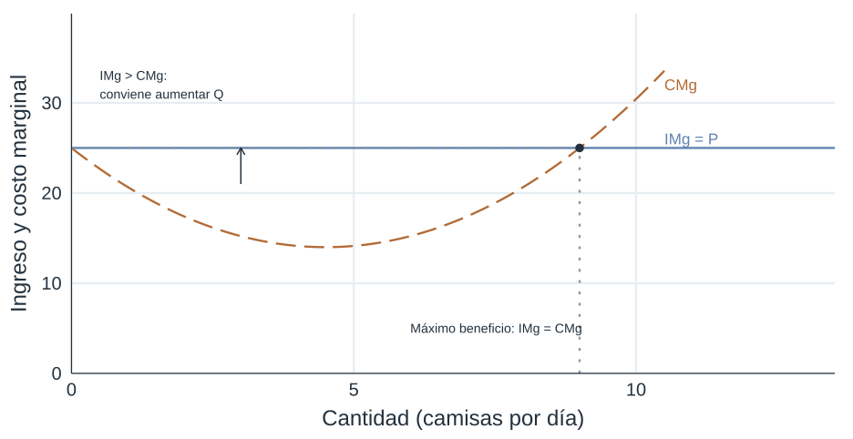
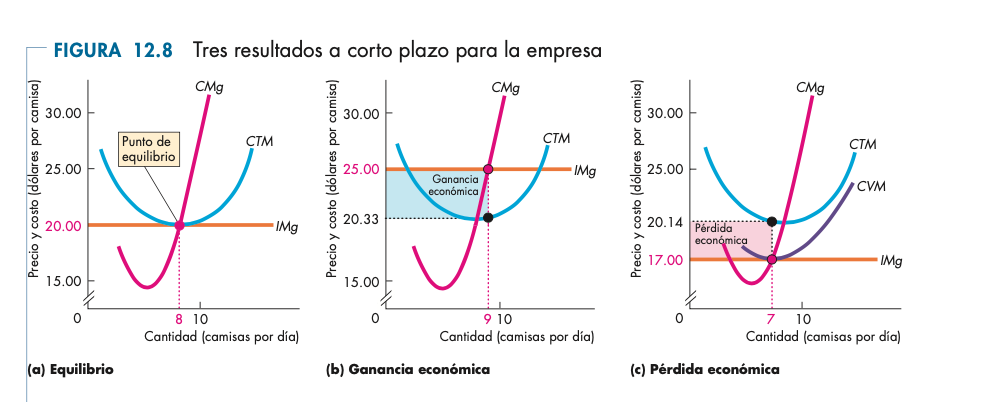
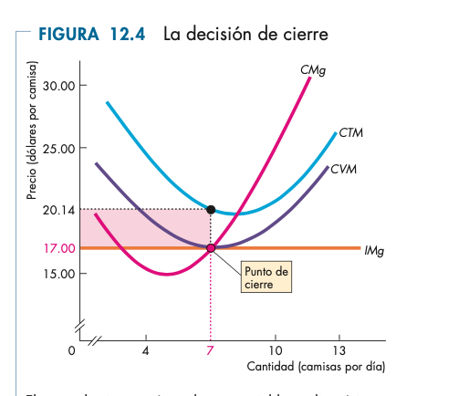

## Estructuras de mercado y organización industrial

- Los mercados no funcionan todos del mismo modo.
- La estructura de mercado afecta precios, cantidades y bienestar.
- La competencia perfecta es el punto de partida del análisis.

## Tipología

- Competencia perfecta
- Monopolio
- Oligopolio
- Competencia monopolística

## Competencia perfecta

- Muchas empresas pequeñas
- Producto homogéneo
- Información amplia
- Libre entrada y salida
- Las firmas toman el precio como dado

## Demanda de mercado y demanda individual

- La demanda de mercado surge de sumar decisiones de muchos consumidores.
- La empresa individual en competencia perfecta enfrenta una demanda horizontal al precio de mercado.

## Motivación de los empresarios

- Producir si es rentable.
- Salir si no cubren costos variables en el corto plazo.
- Entrar cuando observan beneficios económicos positivos.

## Maximización de beneficios

- La firma elige la cantidad donde ingreso marginal y costo marginal coinciden.
- En competencia perfecta, el ingreso marginal es igual al precio.

## Maximización de beneficios (2) {.course-slide}

::: {.visual}
{.plain .nostretch width="82%"}
:::

## La curva de oferta

- La parte creciente del costo marginal por encima del costo variable medio define la oferta de la firma.

## Tres resultados posibles {.course-slide}

::: {.visual}
{.plain .nostretch fig-alt="Tres resultados de corto plazo: beneficio normal, ganancia económica y pérdida económica."}
:::

::: {.takeaway}
Al producir donde P = CMg, el resultado depende de si el precio supera, iguala o queda por debajo del costo total medio.
:::

## Entrada y salida de empresas

- Si hay beneficios, entran empresas.
- Si hay pérdidas sostenidas, salen empresas.
- En el largo plazo, la entrada y salida presionan los beneficios hacia cero.

## Punto de cierre {.course-slide}

:::: {.split}
::: {.explanation}
- Hay pérdidas si P < CTM.
- Conviene cerrar en el corto plazo si P < CVM.
- El punto de cierre está en el mínimo del costo variable medio.
:::
::: {.visual}
{.plain .nostretch fig-alt="Curvas de costo marginal, costo total medio y costo variable medio con el punto de cierre."}
:::
::::

## Equilibrio de corto y largo plazo

- En el corto plazo puede haber beneficios o pérdidas.
- En el largo plazo, con libre entrada y salida, la firma competitiva tiende a beneficio económico cero.

## Eficiencia del equilibrio competitivo

- El precio iguala costo marginal.
- Se maximizan los excedentes dados los recursos disponibles.
- Es un punto de referencia para evaluar otras estructuras de mercado.
