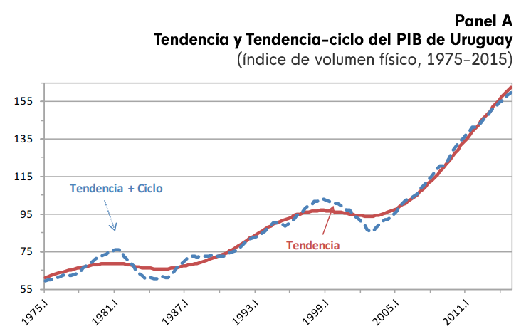
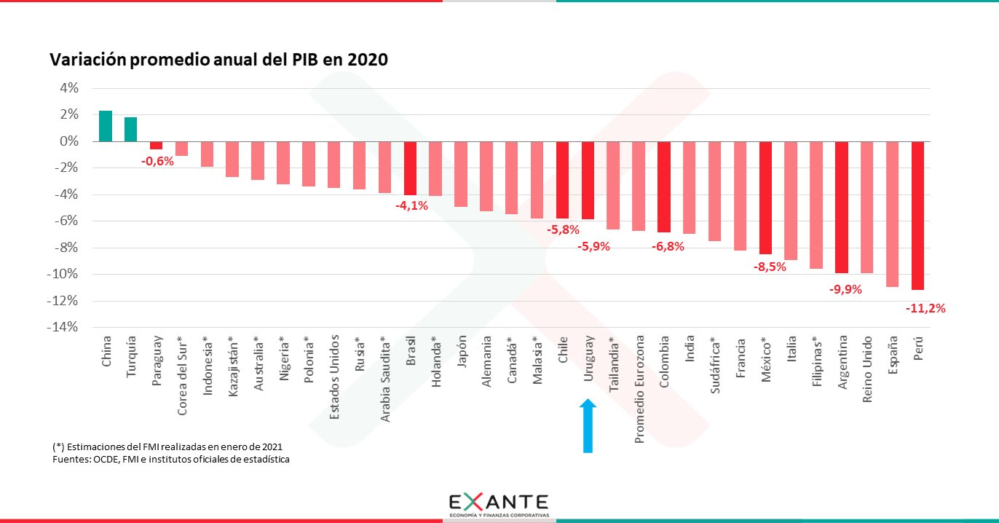
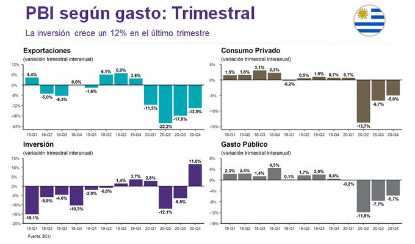
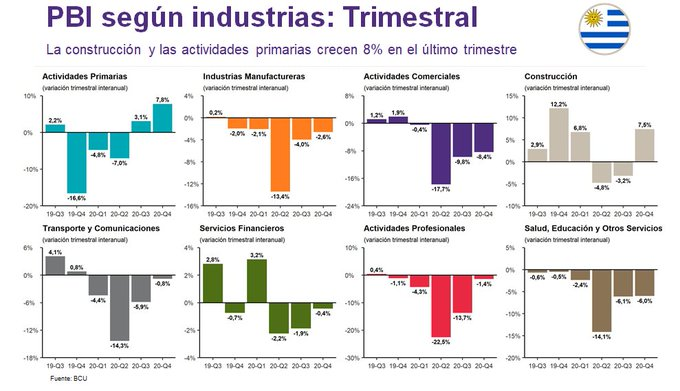
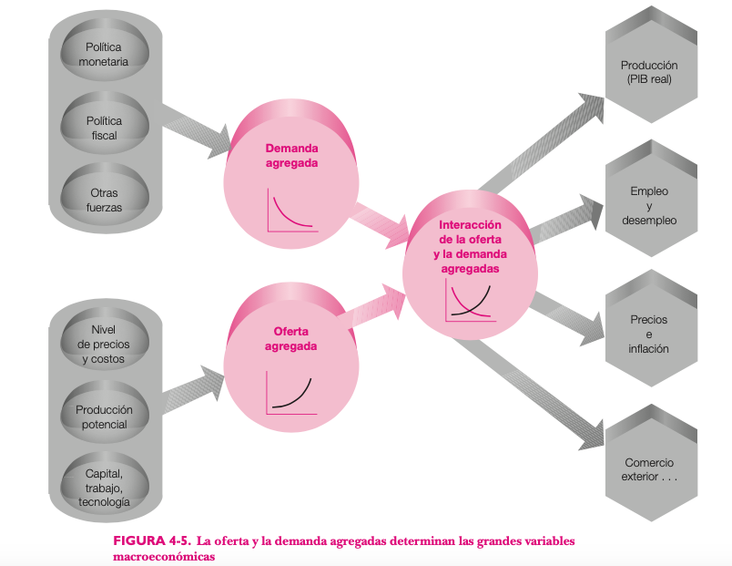
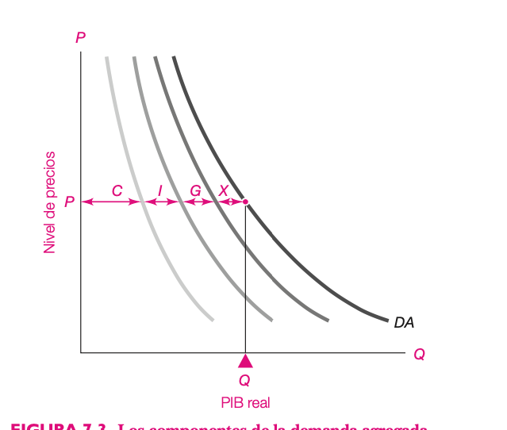
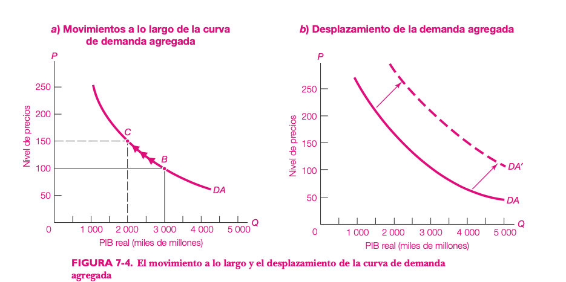
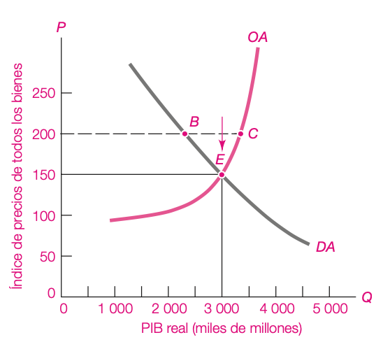
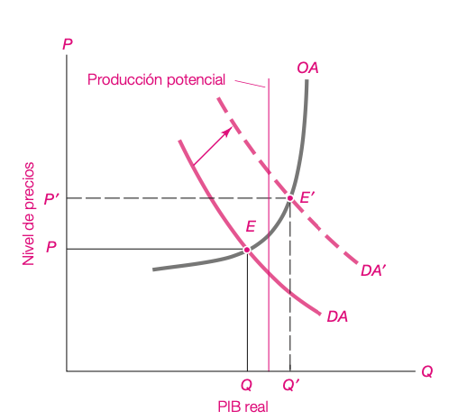

## PIB

Es una medida de todos los bienes y servicios finales que se producen en una región o país en un período de tiempo, valuada a precios de mercado.

## Varias formas de medir el PIB

Como el PIB se mide por transacciones económicas, su valor es igual si lo medimos desde la demanda, desde la oferta o desde los ingresos.

## La oferta

En este enfoque, medimos el valor agregado que genera cada sector de actividad.

$$ PIB = \Sigma\ VAB_{sectores} $$

## El gasto agregado

Desde la demanda, el PIB se mide como la suma de los distintos gastos:

$$ PIB = C + I + G + X $$

- `C`: consumo
- `I`: inversión
- `G`: gasto público
- `X`: exportaciones netas

## Precios corrientes y precios constantes

- Si usamos los precios del período, obtenemos el PIB a precios corrientes.
- Si queremos eliminar el efecto de la inflación, usamos precios constantes de un año base.

## Los ingresos

Como todo lo que se vende en el mercado es el ingreso de algún factor, el PIB también puede medirse desde los ingresos:

$$ PIB = Sueldos + Beneficios + Rentas + Impuestos\ Netos + Depreciación $$

## El problema de la doble contabilización

¿Qué pasa con los bienes que se compran como insumos y no como bienes finales?

## Producto real y producto potencial

- El producto real es la producción observada en cada año.
- El producto potencial busca eliminar el componente cíclico.

## Evolución reciente en Uruguay

{.plain width="86%"}

## PIB nominal vs PIB real

- Como el valor de la producción se mide a precios de mercado, un aumento de precios eleva el PIB nominal.
- Pero si solo suben los precios, la economía no produce más.

## Tweet

<blockquote class="twitter-tweet">
Growth in the <a href="https://twitter.com/hashtag/advancedeconomies?src=hash&amp;ref_src=twsrc%5Etfw">#advancedeconomies</a> group is projected at –5.8% in 2020, 2.3 percentage points stronger than in the June 2020 WEO Update reflecting better-than-foreseen <a href="https://twitter.com/hashtag/US?src=hash&amp;ref_src=twsrc%5Etfw">#US</a> and <a href="https://twitter.com/hashtag/euroarea?src=hash&amp;ref_src=twsrc%5Etfw">#euroarea</a> GDP growth.
&mdash; IMF (@IMFNews) <a href="https://twitter.com/IMFNews/status/1316019642398175233?ref_src=twsrc%5Etfw">October 13, 2020</a></blockquote>

## Algunos usos del PIB

{.plain width="82%"}

## Algunos usos del PIB (2)

{.plain width="82%"}

## Algunos usos del PIB (3)

{.plain width="82%"}

## Preguntas

Busca responder preguntas como:

- ¿Qué tan difícil es encontrar empleo?
- ¿Los salarios y el bienestar material de la población están mejorando?
- ¿Qué pasa con el nivel de precios y el poder adquisitivo de los ingresos?
- ¿Cómo se comporta el tipo de cambio?

## Contexto histórico

:::: {.columns}
::: {.column width="60%"}
- John Maynard Keynes originó esta rama de la economía en los años 30.
- Desarrolló los fundamentos teóricos de las políticas macroeconómicas.
:::
::: {.column width="40%"}
{.plain width="88%"}
:::
::::

## Objetivos de la política macroeconómica

- Nivel de actividad económica alto y creciente
- Nivel de precios estable
- Desempleo bajo

## Instrumentos de la política macroeconómica

- Política fiscal
- Política monetaria
- Inserción internacional

## Actividad económica

- Las economías modernas pasan por períodos de auge y caída.
- En los períodos de auge es más fácil conseguir empleo.
- En las recesiones, las empresas producen menos y el desempleo aumenta.

## Explicaciones

- Endógenas: crisis financieras y ciclos de negocios
- Exógenas: pánicos, hiperinflación, burbujas, pandemias

## El modelo de oferta y demanda agregadas

- Es una teoría que busca explicar los ciclos de la economía.

## Oferta y demanda agregadas

{.plain width="82%"}

## La oferta agregada

- Tiene pendiente positiva en el plano $(Y, P)$.
- Cambia cuando cambian los factores de producción o la tecnología.

## Demanda agregada

- Es el producto total que se demanda para cada nivel de precios.
- Tiene cuatro componentes: consumo, inversión, gasto público y exportaciones netas.

$$ DA = C + I + G + NX $$

## Consumo

- Es el gasto de los hogares en bienes y servicios.
- Depende positivamente del ingreso real.
- Depende negativamente de los impuestos al consumo.

## Inversión

- Es el gasto de las empresas en bienes que aumentan la producción futura.
- Depende de las condiciones crediticias, las expectativas y la política económica.

## Gasto público

- Es el gasto del gobierno en bienes, servicios y transferencias.
- Es una variable que decide el gobierno.

## Exportaciones netas

- Son las exportaciones menos las importaciones.
- Dependen del tipo de cambio, de los precios relativos y del ingreso externo.

## Componentes de la demanda agregada

{.plain width="82%"}

## Demanda agregada (pendiente)

- Tiene pendiente negativa.
- Si sube el nivel de precios, caen los ingresos reales.
- También bajan exportaciones y suben importaciones.

## Movimientos en la demanda agregada

{.plain width="82%"}

## Cambios en la DA

- Variables de política
  - Política monetaria
  - Política fiscal
- Variables exógenas
  - Ingreso internacional
  - Activos
  - Tecnología
  - Otros

## Equilibrio macroeconómico

{.plain width="82%"}

## Shock en la demanda

{.plain width="82%"}
