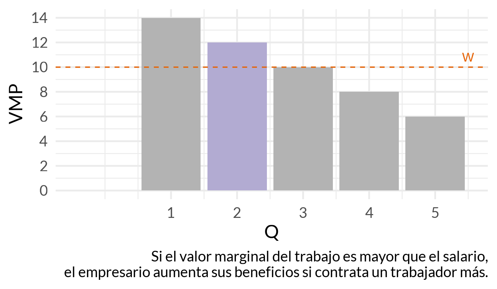
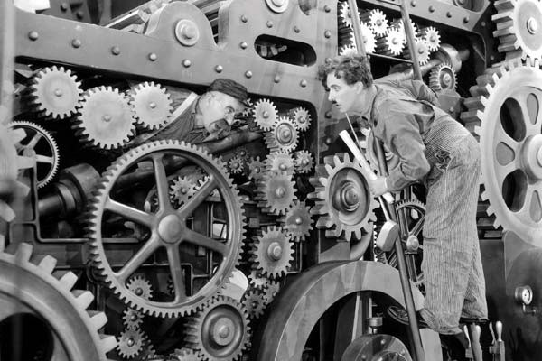
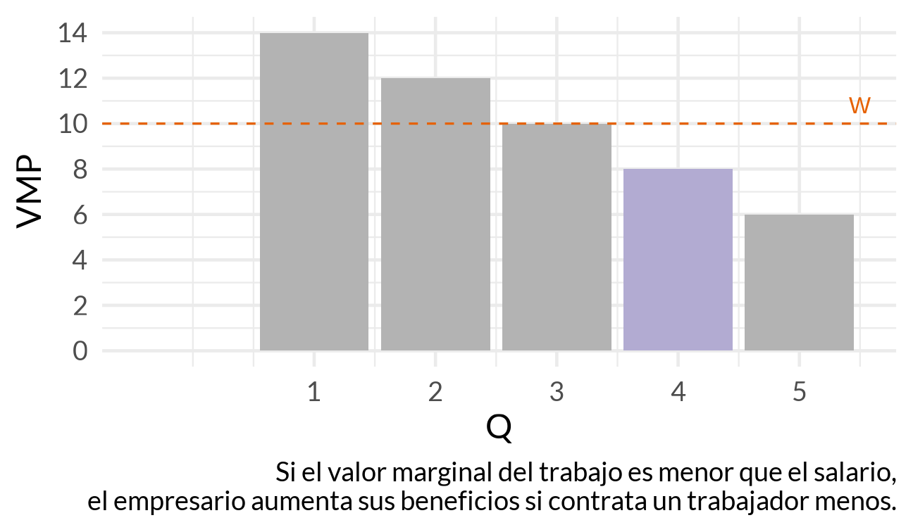
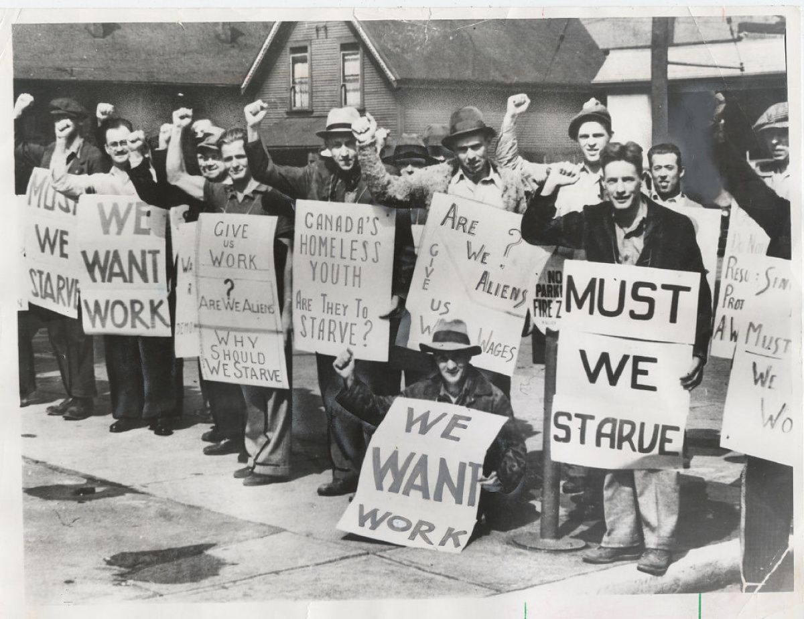

## Ingresos y factores de producción

- Los hogares obtienen ingresos vendiendo factores productivos.
- En el mercado de trabajo, el factor es el trabajo y su precio es el salario.

## Los ingresos de los hogares

- Salarios
- Rentas
- Intereses
- Beneficios

## Demanda de trabajo

- La empresa contrata trabajo según el valor del producto marginal.
- Ese valor depende de la productividad y del precio del bien producido.

## El valor del producto marginal

- Resume cuánto aporta un trabajador adicional medido en dinero.

## ¿Cuántos trabajadores contratan las empresas?

- Mientras el valor del producto marginal sea mayor que el salario, conviene contratar.
- Si es menor, conviene reducir empleo.

## Gráfico base

{.plain width="82%"}

## Si el VPMg > W

- Contratar un trabajador más aumenta beneficios.

## Q = 2 no es de equilibrio

{.plain width="82%"}

## Si el VPMg < W

- Contratar un trabajador adicional reduce beneficios.

## Maximización de beneficios

{.plain width="82%"}

## ¿Qué pasa si sube el salario?

- La cantidad demandada de trabajo cae.
- La empresa se mueve a lo largo de su curva de demanda de trabajo.

## Curva de demanda de trabajo

- Tiene pendiente negativa.

## La oferta de trabajo

- Depende de preferencias entre ocio e ingreso.
- También depende de instituciones y normas sociales.

## Equilibrio en el mercado de trabajo

- El salario y el empleo de equilibrio se determinan por la interacción de oferta y demanda.

## Mercado de trabajo segmentado

- No todos los trabajadores compiten en el mismo mercado.
- Hay diferencias por calificación, género, edad, región e informalidad.

## Clasificación de la población

- Ocupados
- Desocupados
- Inactivos

## Indicadores del desempeño del mercado de trabajo

- Tasa de empleo
- Tasa de desocupación
- Tasa de actividad

## Mercado de trabajo en Uruguay: evolución reciente

{.plain width="84%"}

## Indicadores

{.plain width="82%"}

## Desempleados desalentados

- Personas que querrían trabajar pero dejaron de buscar.

## Otros problemas de empleo

- Subempleo
- Informalidad
- Inestabilidad laboral

## Diferencias en el mercado laboral

- Edad
- Género
- Educación
- Territorio

## Tres tipos de desempleo

- Cíclico
- Estructural
- Friccional

## Desempleo cíclico

{.plain width="82%"}

## Desempleo estructural

- Cambios tecnológicos o sectoriales dejan habilidades obsoletas.

## Desempleo friccional

- Surge por el tiempo de búsqueda y emparejamiento entre empresas y trabajadores.

## Mercado de trabajo en Uruguay: evolución de mediano plazo

{.plain width="82%"}

## Envejecimiento de la población

- Cambia la composición de la fuerza de trabajo.
- Afecta participación, empleo y sostenibilidad fiscal.

## Causas

- Mayor esperanza de vida
- Menor fecundidad
- Cambios demográficos acumulados

## Activos por sexo

- La participación laboral femenina cambió fuertemente en las últimas décadas.
