## Ingresos y factores de producción

- Los hogares obtienen ingresos vendiendo factores productivos.
- En el mercado de trabajo, el factor es el trabajo y su precio es el salario.
- Los ingresos de los hogares provienen de:
  - Salarios
  - Rentas
  - Intereses
  - Beneficios

## Demanda de trabajo

- La empresa contrata trabajo según el valor del producto marginal.
- Ese valor depende de la productividad y del precio del bien producido.
- El valor del producto marginal (VPMG)

Resume cuánto aporta un trabajador adicional medido en dinero.

## ¿Cuántos trabajadores contratan las empresas?

- Si el valor del producto marginal es mayor que el salario, conviene contratar trabajadores.
- Si el valor del producto marginal es menor que el salario, conviene despedir trabajadores.

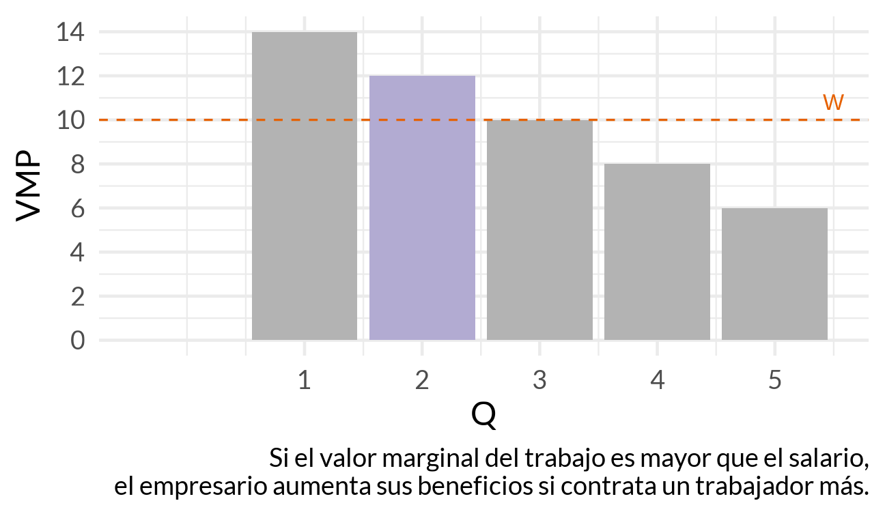{.plain .nostretch}

## Si el VPMg > W

- Contratar un trabajador más aumenta beneficios.

## Q = 2 no es de equilibrio {.diagram-slide}

{.plain .nostretch}

## Si el VPMg < W {.diagram-slide}

- Contratar un trabajador adicional reduce beneficios.

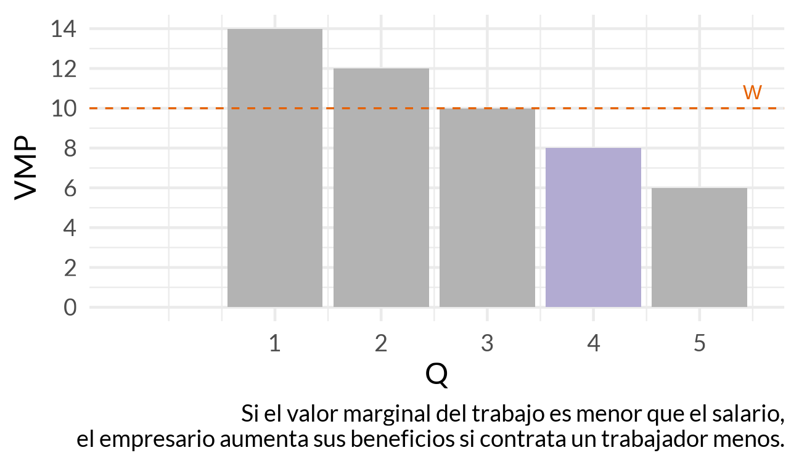{.plain .nostretch}

## Maximización de beneficios {.diagram-slide}

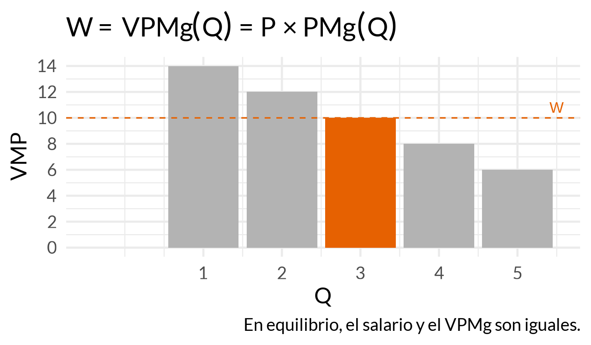{.plain .nostretch}

## ¿Qué pasa si sube el salario? {.diagram-slide}

- La cantidad demandada de trabajo cae.
- La empresa se mueve a lo largo de su curva de demanda de trabajo.

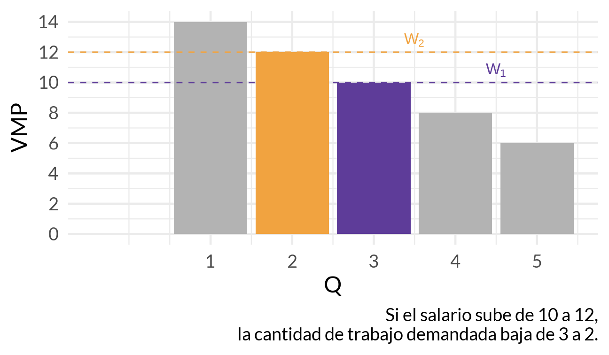{.plain .nostretch}

## Curva de demanda de trabajo {.diagram-slide}

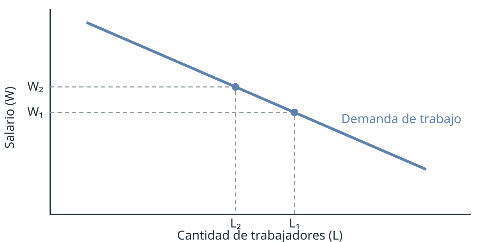{.plain .nostretch .labor-demand-diagram fig-alt="Curva de demanda de trabajo con pendiente negativa. Cuando el salario aumenta de W1 a W2, la cantidad demandada disminuye de L1 a L2."}

::: {.notes}
Si sube el salario, disminuye la cantidad demandada de trabajo.
:::

## La oferta de trabajo

- Depende de preferencias entre ocio e ingreso.
- También depende de instituciones y normas sociales.

## Equilibrio en el mercado de trabajo {.diagram-slide}

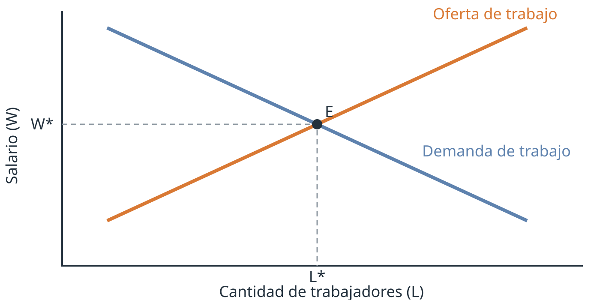{.plain .nostretch .labor-equilibrium-diagram fig-alt="La oferta y la demanda de trabajo se cruzan en E, determinando el salario W* y la cantidad de trabajadores L* de equilibrio."}

::: {.notes}
La oferta y la demanda determinan el salario y el empleo de equilibrio.
:::

## Mercado de trabajo segmentado {.diagram-slide}

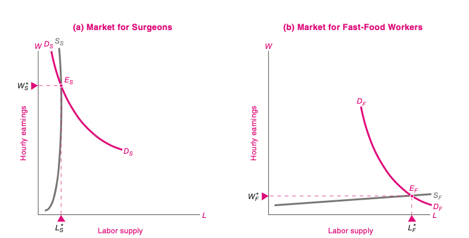{.plain .nostretch fig-alt="Dos mercados laborales lado a lado: cirujanos y trabajadores de comida rápida, con distintas curvas de oferta y demanda y distintos salarios de equilibrio."}

::: {.notes}
- No todos los trabajadores compiten en el mismo mercado.
- Hay diferencias por calificación, género, edad, región e informalidad.
:::

## Cómo medimos el empleo {.section-cover .center background-image="imgs/separador-medicion.png" background-size="cover" background-color="#111111" background-opacity="0.65"}

## Clasificación de la población {.diagram-slide}

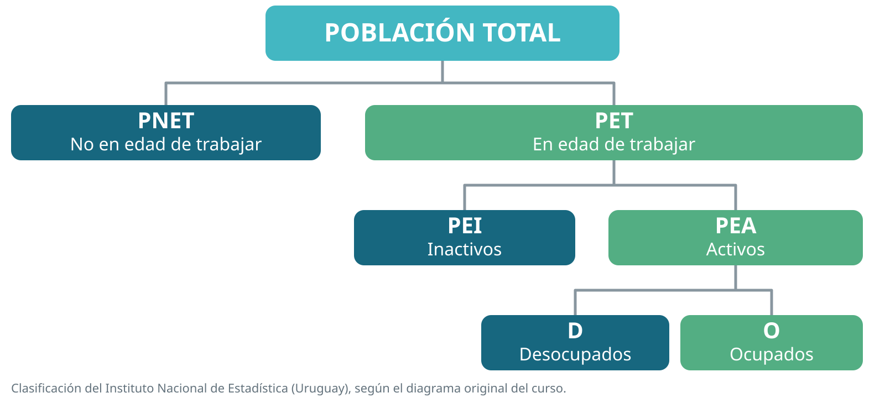{.plain .nostretch .population-diagram fig-alt="Clasificación de la población: población total dividida en PNET y PET; PET dividida en inactivos (PEI) y activos (PEA); PEA dividida en desocupados (D) y ocupados (O)."}

## Indicadores del desempeño del mercado de trabajo

- Las tasas se expresan como porcentajes.
- O = ocupados; D = desocupados.

::: {.incremental}
- **Tasa de empleo:** $TE = \frac{O}{PET} \times 100$
- **Tasa de desocupación:** $TD = \frac{D}{PEA} \times 100$
- **Tasa de actividad:** $TA = \frac{PEA}{PET} \times 100$
:::

## Desempleo y problemas de empleo {.section-cover .center background-image="imgs/separador-desempleo.png" background-size="cover" background-color="#111111" background-opacity="0.65"}

## Desempleados desalentados

- Personas que querrían trabajar pero dejaron de buscar.

## Otros problemas de empleo

- Subempleo
- Informalidad
- Inestabilidad laboral

## Diferencias en el mercado laboral

- Edad
- Género
- Educación
- Territorio

## Tres tipos de desempleo

- Cíclico
- Estructural
- Friccional

## Desempleo cíclico {.diagram-slide}

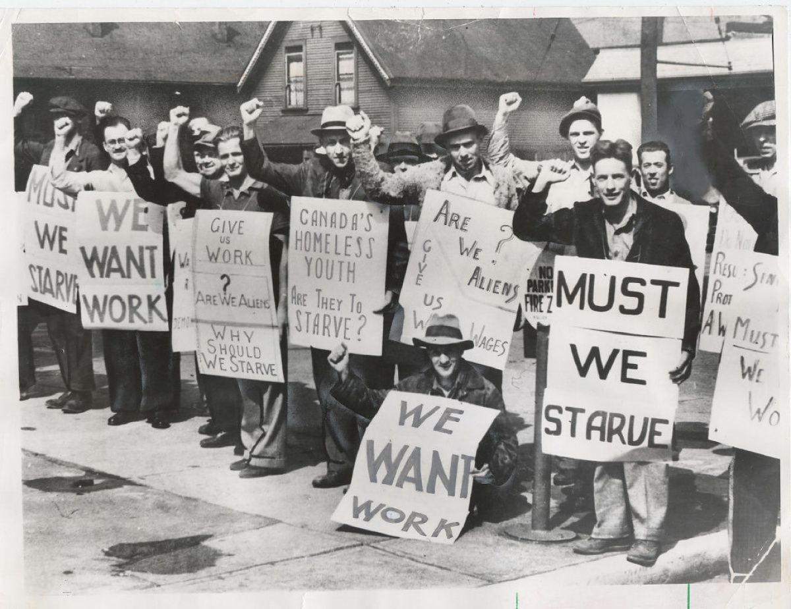{.plain .nostretch}

## Desempleo estructural {.diagram-slide}

- Cambios tecnológicos o sectoriales dejan habilidades obsoletas.

{.plain .nostretch fig-alt="Robot construyendo una pared de ladrillos: automatización de tareas en la construcción."}

## Desempleo friccional

- Surge por el tiempo de búsqueda y emparejamiento entre empresas y trabajadores.

## Transformaciones del trabajo en Uruguay {.section-cover .center background-image="imgs/separador-transformaciones.png" background-size="cover" background-color="#111111" background-opacity="0.65"}

## Mercado de trabajo en Uruguay: evolución de mediano plazo

- Envejecimiento de la población
- Aumento de la tasa de actividad
- Retraso en las edades de ingreso y egreso al mercado de trabajo
- Cambio tecnológico

## Envejecimiento de la población {.diagram-slide}

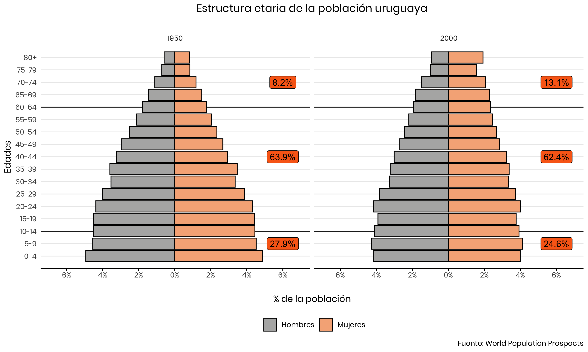{.plain .nostretch .historical-chart fig-alt="Pirámides de la población uruguaya en 1950 y 2000, por edad y sexo, que ilustran el envejecimiento de la población."}

## Causas {.diagram-slide}

- Menor natalidad y mayor esperanza de vida.

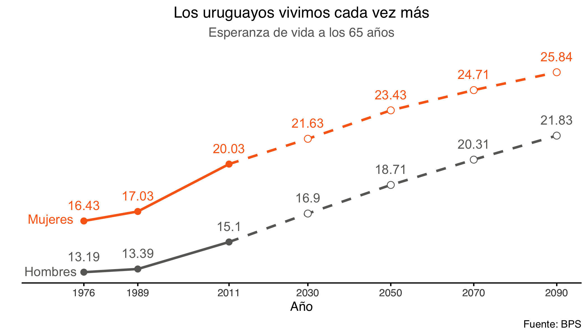{.plain .nostretch .historical-chart .chart-with-text fig-alt="Esperanza de vida a los 65 años por sexo: datos históricos y proyecciones del BPS. Las proyecciones aparecen con líneas discontinuas."}

## Activos por sexo {.diagram-slide}

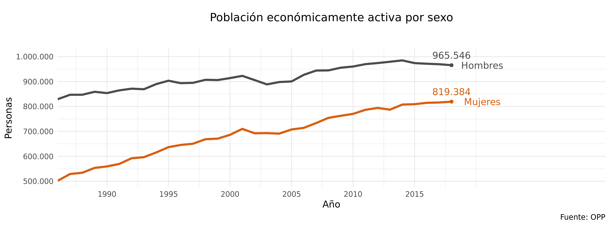{.plain .nostretch .historical-chart fig-alt="Evolución histórica de la población económicamente activa por sexo, con un aumento de la cantidad de mujeres activas. Fuente: OPP."}
