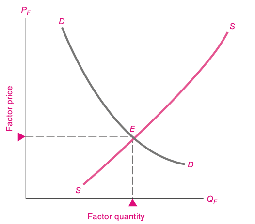
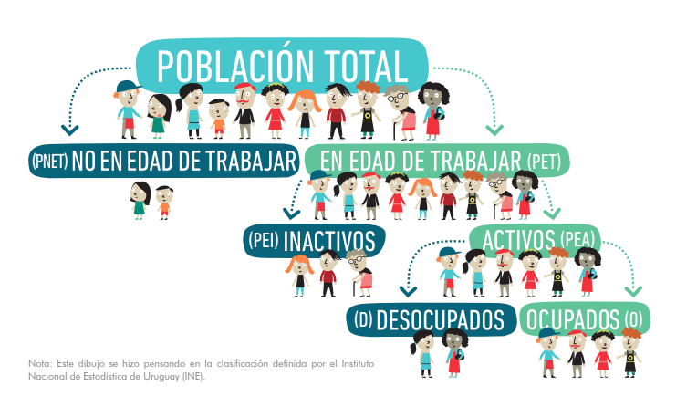
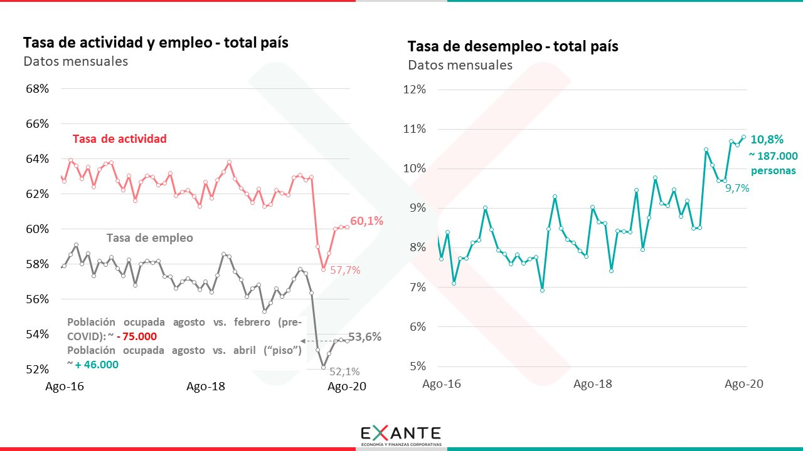

## Ingresos y factores de producción

- Los hogares obtienen ingresos vendiendo factores productivos.
- En el mercado de trabajo, el factor es el trabajo y su precio es el salario.

## Los ingresos de los hogares

- Salarios
- Rentas
- Intereses
- Beneficios

## Demanda de trabajo

- La empresa contrata trabajo según el valor del producto marginal.
- Ese valor depende de la productividad y del precio del bien producido.

## El valor del producto marginal

- Resume cuánto aporta un trabajador adicional medido en dinero.

## ¿Cuántos trabajadores contratan las empresas?

- Mientras el valor del producto marginal sea mayor que el salario, conviene contratar.
- Si es menor, conviene reducir empleo.

## Gráfico base

{.plain width="82%"}

## Si el VPMg > W

- Contratar un trabajador más aumenta beneficios.

## Q = 2 no es de equilibrio

{.plain width="82%"}

## Si el VPMg < W

- Contratar un trabajador adicional reduce beneficios.

{.plain width="82%"}

## Maximización de beneficios

{.plain width="82%"}

## ¿Qué pasa si sube el salario?

- La cantidad demandada de trabajo cae.
- La empresa se mueve a lo largo de su curva de demanda de trabajo.

{.plain width="82%"}

## Curva de demanda de trabajo

- Si sube el salario, disminuye la cantidad demandada de trabajo.

{.plain .labor-demand-diagram height="660" fig-alt="Curva de demanda de trabajo con pendiente negativa. Cuando el salario aumenta de W1 a W2, la cantidad demandada disminuye de L1 a L2."}

## La oferta de trabajo

- Depende de preferencias entre ocio e ingreso.
- También depende de instituciones y normas sociales.

## Equilibrio en el mercado de trabajo

- La oferta y la demanda determinan el salario y el empleo de equilibrio.

{.plain .labor-equilibrium-diagram height="660" fig-alt="Oferta y demanda de trabajo: el punto de intersección determina el salario y la cantidad de trabajadores de equilibrio."}

## Mercado de trabajo segmentado

- No todos los trabajadores compiten en el mismo mercado.
- Hay diferencias por calificación, género, edad, región e informalidad.

## Cómo medimos el empleo {.section-cover .center background-image="imgs/separador-medicion.png" background-size="cover" background-color="#111111" background-opacity="0.65"}

## Clasificación de la población

{.plain .population-diagram height="760" fig-alt="Clasificación de la población: población total dividida en PNET y PET; PET dividida en inactivos (PEI) y activos (PEA); PEA dividida en desocupados (D) y ocupados (O)."}

## Indicadores del desempeño del mercado de trabajo

Las tasas se expresan como porcentajes. O = ocupados; D = desocupados.

::: {.incremental}
- **Tasa de empleo:** $TE = \frac{O}{PET} \times 100$
- **Tasa de desocupación:** $TD = \frac{D}{PEA} \times 100$
- **Tasa de actividad:** $TA = \frac{PEA}{PET} \times 100$
:::

## Desempleo y problemas de empleo {.section-cover .center background-image="imgs/separador-desempleo.png" background-size="cover" background-color="#111111" background-opacity="0.65"}

## Desempleados desalentados

- Personas que querrían trabajar pero dejaron de buscar.

## Otros problemas de empleo

- Subempleo
- Informalidad
- Inestabilidad laboral

## Diferencias en el mercado laboral

- Edad
- Género
- Educación
- Territorio

## Tres tipos de desempleo

- Cíclico
- Estructural
- Friccional

## Desempleo cíclico

{.plain width="82%"}

## Desempleo estructural

- Cambios tecnológicos o sectoriales dejan habilidades obsoletas.

## Desempleo friccional

- Surge por el tiempo de búsqueda y emparejamiento entre empresas y trabajadores.

## Transformaciones del trabajo en Uruguay {.section-cover .center background-image="imgs/separador-transformaciones.png" background-size="cover" background-color="#111111" background-opacity="0.65"}

## Mercado de trabajo en Uruguay: evolución reciente

{.plain width="84%"}

## Mercado de trabajo en Uruguay: evolución de mediano plazo

- Envejecimiento de la población
- Aumento de la tasa de actividad
- Retraso en las edades de ingreso y egreso al mercado de trabajo
- Cambio tecnológico

## Envejecimiento de la población

{.plain .historical-chart fig-alt="Pirámides de la población uruguaya en 1950 y 2000, por edad y sexo, que ilustran el envejecimiento de la población."}

## Causas

- Menor natalidad y mayor esperanza de vida.

{.plain .historical-chart .chart-with-text fig-alt="Esperanza de vida a los 65 años por sexo: datos históricos y proyecciones del BPS. Las proyecciones aparecen con líneas discontinuas."}

## Mayor participación femenina en el mercado de trabajo

{.plain .participation-image height="720" fig-alt="Artículo histórico titulado La pareja: cuando los dos trabajan."}

## Activos por sexo

{.plain .historical-chart fig-alt="Evolución histórica de la población económicamente activa por sexo, con un aumento de la cantidad de mujeres activas. Fuente: OPP."}
